Parallel Lines and Triangles
======================================

Parallel Lines
---------------

The two horizontal lines are parallel with a transversal intersecting the two lines. Notice which angles are equal and which are supplementary.

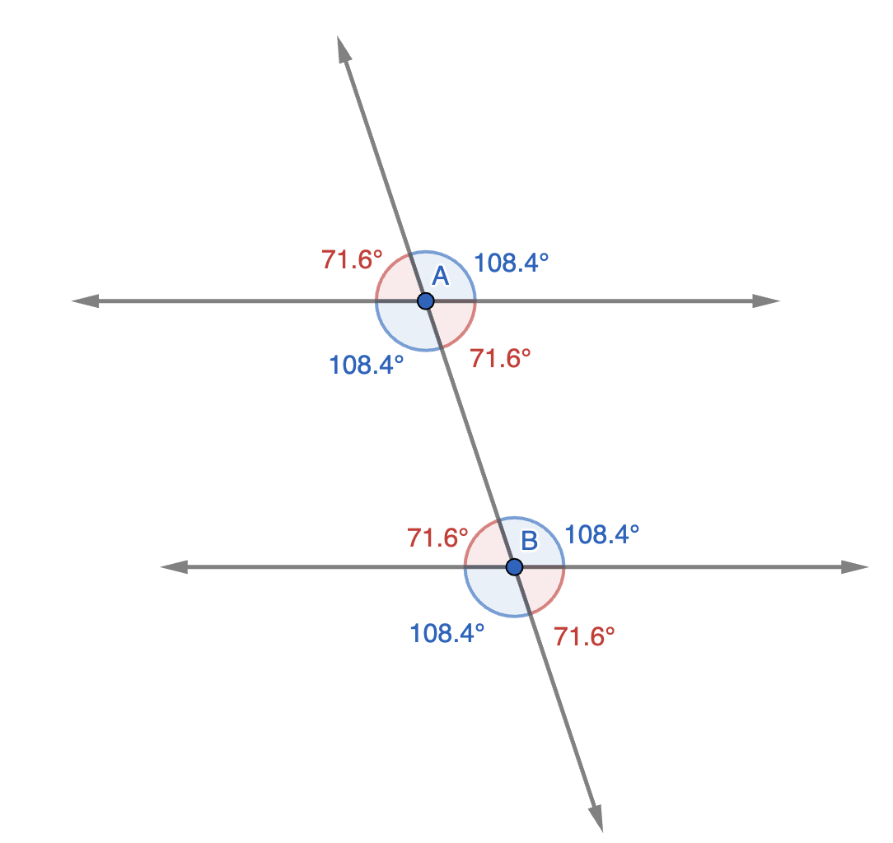

Triangle Inequality
---------------------

**In any triangle, the sum of any two sides is greater than the third side**

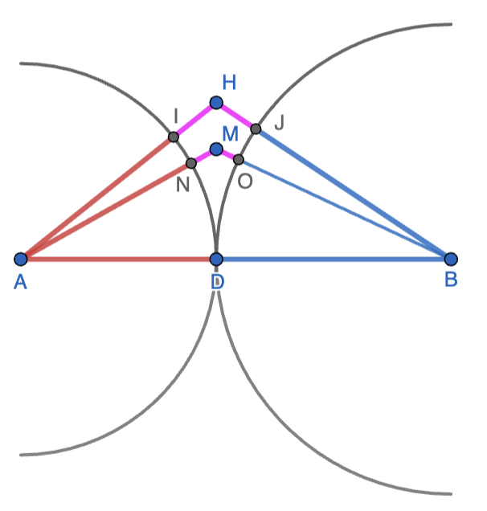

The intuition can be obtained using the above figure. All the red segments are congruent and all the blue segments are congruent. Moreover, :math:`AD+DB=AB`. Thus, in triangle AHB, the purple part is :math:`(AH+BH)-AB`. In triangle AMB, the purple part is :math:`(AM+BM)-AB`. Thus, the two sides of the triangle other than AB sum up to AB only when the triangle collapses to ADB. In the other cases, there is the "purple" part that makes the sum larger than AB.

**Another way to think of this is that the shortest distance from A to B is along the straight segment. Distance along any other path is larger.**

Conversely, any set of three numbers - a, b, c - that satisfy the triangle inequalities can form a triangle. Note that all three inequalities have to be satisfied. Any set of three numbers that violates one or more of the inequalities cannot form a triangle.

.. math::

   &a + b > c

   &b + c > a

   &c + a > b

For example, if two sides of a triangle are :math:`a=4` and :math:`b=7`, the range for the third side is :math:`|a-b| < c < a+b` i.e. :math:`3 < c < 11`.

:math:`c\geq 11\implies c \geq a+b` - a violation of the first inequality.

:math:`c\leq 3\implies c+a\leq b` - a violation of the last inequality.

Hence, a combination such as (2,4,7) cannot form a triangle.    

Distance Properties
--------------------

**The longest side in a right-angled triangle is the hypotenuse**

**The shortest distance to a line from a point not on it is the length of the perpendicular segment dropped from the point to the line**

**In any triangle, the lengths of the sides are in the same order at the angles opposite the sides (Longest side opposite the largest angle, shortest side opposite the smallest angle, and the third side opposite the third angle)**

Triangle Congruence
---------------------

Two triangles are congruent when they can be made to coincide through translation and rotation.

The corresponding parts - three sides and three angles - of two congruent traingles are congruent.

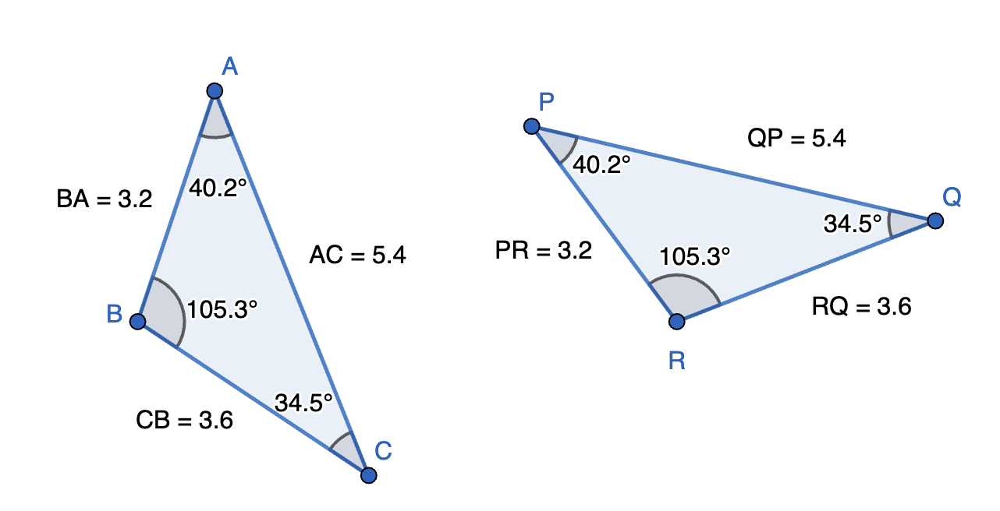

The congruence of triangles ABC and PRQ in the above figure is denoted by :math:`\Delta ABC\cong \Delta PRQ`.
	  
Out of the six parts, what are the minimum parts of two triangles that need to be congruent to guarantee that the triangles are congruent?

* **All three sides (SSS)**

For a right-angled triangle, congruence of one leg of the right-triangle and the hypotenuse is equivalent to the SSS test as the third side is constrained via Pythagoras theorem. We call this the **hypotensue-leg test**

* **Any two angles and a side (ASA or AAS)**

Note that congruence of two angles guarantees the congruence of the third angle as the three angles in both triangles have to add up to :math:`180^o`. However, congruence of angles does not guarantee congruence of triangles. The sides of a triangle can be doubled without changing the angles of the triangle.

Additionally, congruence of any two sides and an angle need not be sufficient to ensure congruence. In the example below. Triangles ABD and ABE have two correspongind sides and a corresponding angle congruent. However, the triangles are not congruent.
  
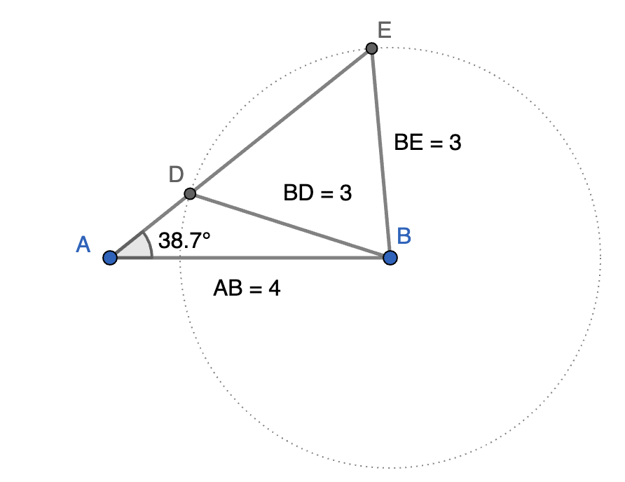

* **Two sides and an angle are sufficient only if the angle is common to the two sides or is included by the two sides (SAS)**
  
	  
Triangle Similarity
----------------------

Two triangles are similar when corresponding angles are congruent and the corresponding sides are proportional.

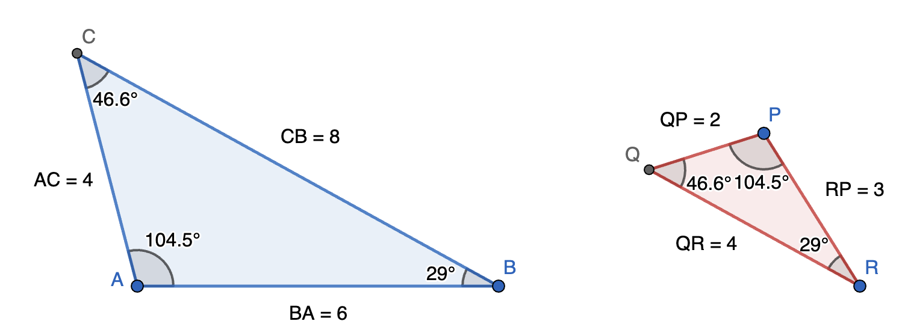

The similarity of triangles ABC and PRQ in the above figure is denoted by :math:`\Delta ABC\sim \Delta PRQ`.
	  
Minimal criteria to guarantee similarity:

* **Corresponding sides are proportional (SSS)**

* **Two corresponding angles are equal (AA)**

  The third angle will be equal automatically.

* **Two sides are proportional and the included angle is congruent (SAS)**
	
Note: If the ratio of the sides between two similar triangles is :math:`k`, the ratio of the perimeter of the two triangles is also :math:`k`. However, the ratio of the area of the two triangles is :math:`k^2`.

This principle is more general and applies to arbitrary similar 2D and 3D shapes.

For 2D shapes, all linear dimensions scale identically. If the sides of a traingle are in proportion :math:`k`, then other linear dimensions such as corresponding altitude, median, angle bisector, perpendicular bisector, in-radius, circum-radius are all in the same proportion :math:`k`. However, area of the triangle, area of incircle, area of circumcircle, areas of correspoding parts of the triangles are all in proportial :math:`k^2`. If two maple leaves are similar and the distance between two adjacent tips is in proportion :math:`k`, then their areas will be in the proportion :math:`k^2`.

For 3D shapes, if the linear dimensions of similar objects scale as :math:`k`, then the surface area will scale as :math:`k^2` and the volume as :math:`k^3`. 
  
We now look at some common scenarios where similar triangles show up.

=================================================

AB and DE are parallel. Thus, :math:`\angle BAC=\angle DEC` and :math:`\angle ACB=\angle ECD` (AA test).

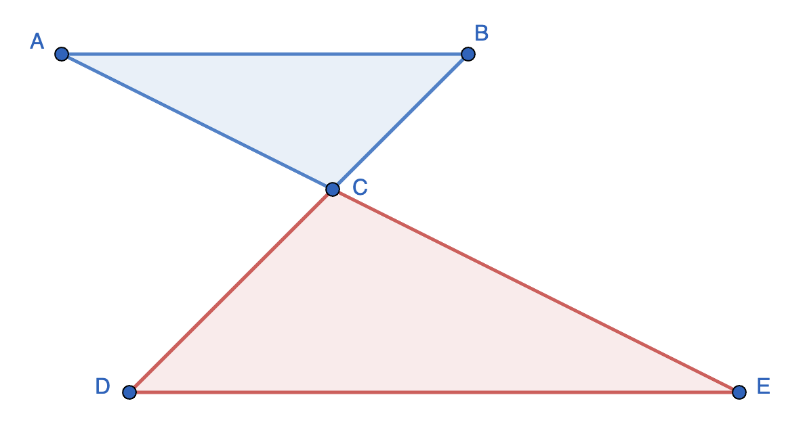

=================================================

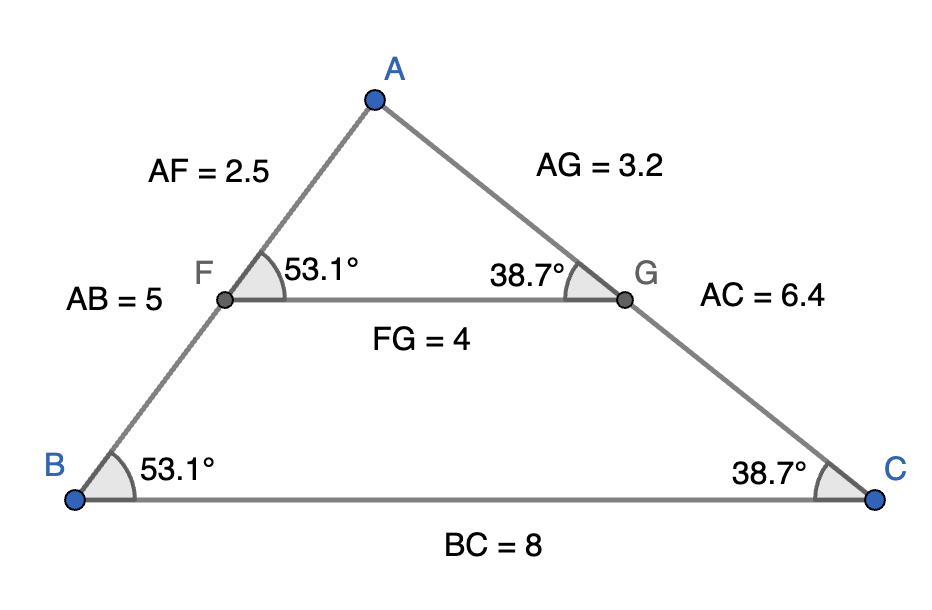

FG and BC are parallel. Thus, :math:`\angle AFG=\angle ABC` and :math:`\angle AGF=\angle ACB` (AA test).

Therefore,

.. math::

   \frac{AF}{AB}=\frac{AG}{AC}=\frac{FG}{BC}=k

We have introduced :math:`k` to denote the ratio that is common to the three corresponding sides - the scale factor. The scale factor is useful for algebraic manipulations as shown below.

.. math::

   &AF = k\cdot AB,~AG = k\cdot AC

   &FB = AB - AF = (1-k)\cdot AB,~GC=AC-AG=(1-k)\cdot AC

   &\frac{FB}{GC}=\frac{AB}{AC}

   &\frac{FB}{AB}=\frac{GC}{AC}

=================================================

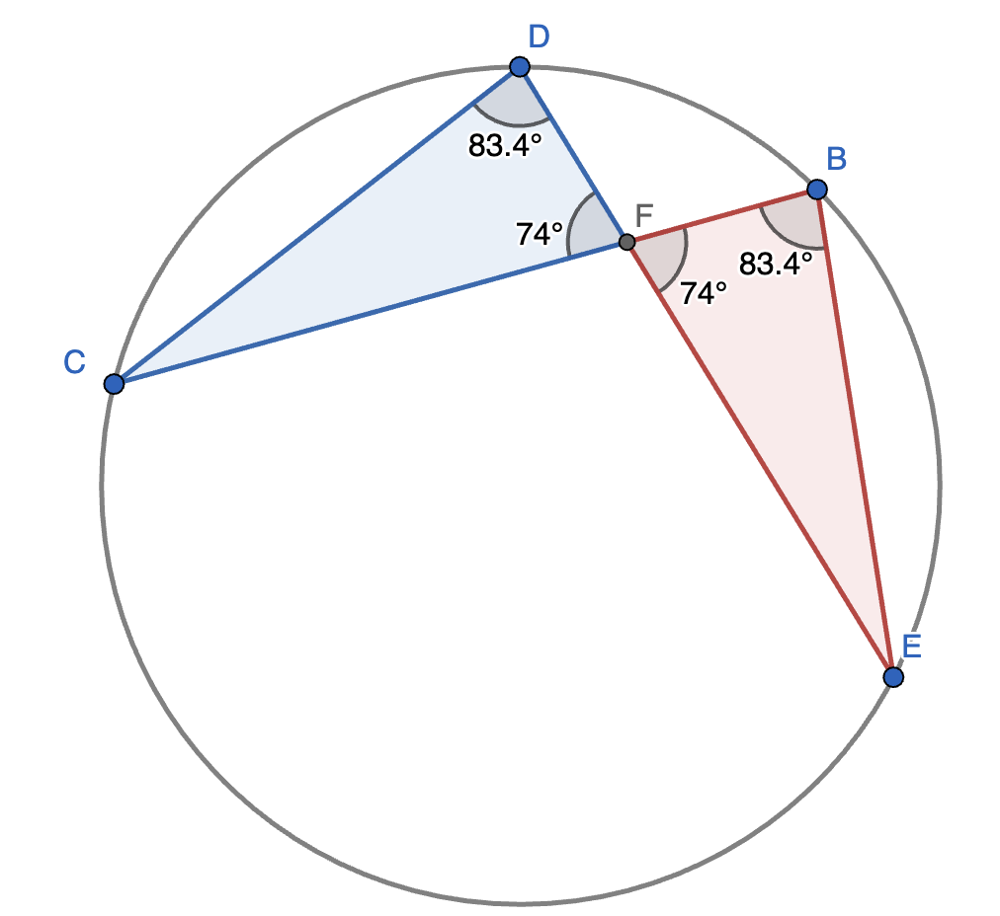

:math:`\angle CDE=\angle CBE` (Angles incribed in the same arc)

:math:`\angle DFC=\angle BFE` (Vertically oppoite angles)

Hence, AA test passes.

This results in the chord-intersection theorem:

:math:`\frac{DF}{BF}=\frac{FC}{FE}\implies DF \times FE = BF \times FC`
	  
=================================================

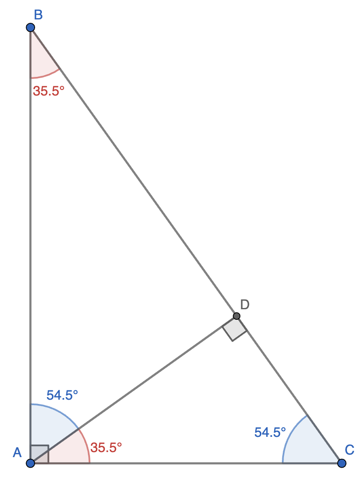

A perpendicular dropped from the right angle of a right-angled triangle to the hypotenuse creates two traingles similar to the original right-angled triangle. The side proportionality relations can be written out. The commonly seen ones are

.. math::

   & \frac{AD}{DC}=\frac{BD}{AD}\implies AD^2=DC\cdot DB

   & \frac{AD}{AC}=\frac{AB}{BC}\implies AD\cdot BC=AB\cdot AC = 2\times \text{Area of}~\Delta ABC

=================================================

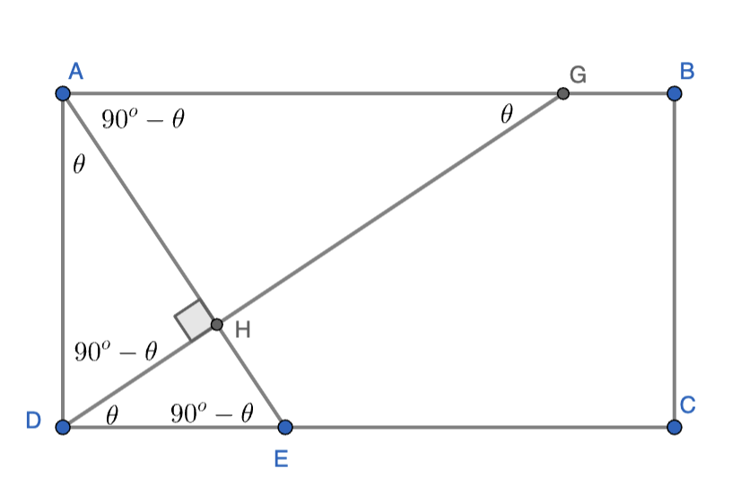

When segments starting at two corners of a rectangle intersect at right angles, several similar triangles are created. This can be seen by denoting :math:`\angle HDE` by :math:`\theta` and then noting down all the other angles obtained by angle-chasing. In fact, when triangles with multiple right angles are involved, it is a great idea to list out the angles obtained by angle-chasing as is seen in this example.

We have

.. math::

   \Delta DEH\sim \Delta GAH\sim \Delta ADH\sim \Delta GDA\sim \Delta AED~\text{(All by AA test)}

Area Ratios
-------------

Some geometrical setups lead to the ratio of areas being equal to the ratio of specific sides. This is different from the situation in similar figures where the area ratio goes as the square of the linear dimension ratio.

=================================================

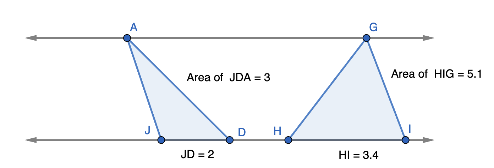

The two horizontal lines are parallel. Thus, :math:`\Delta AJD` and :math:`\Delta GHI` have the same height. There areas are in the ratio of their bases.

.. math::

   \frac{\text{Area}~\Delta AJD}{\text{Area}~\Delta GHI}=\frac{JD}{HI}

	  
=================================================

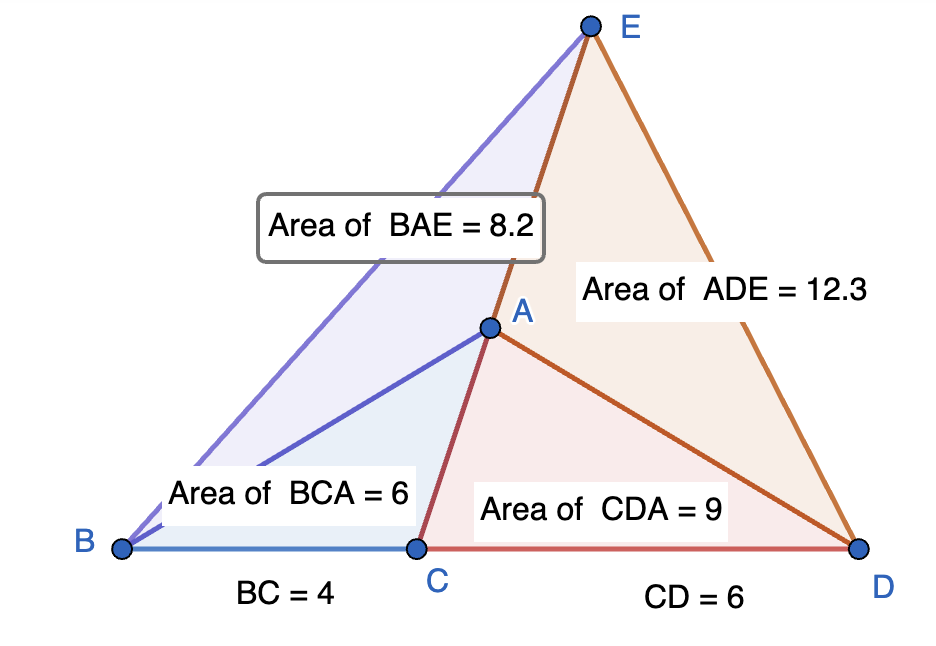

:math:`\Delta ABC` and :math:`\Delta ADC` are adjacent triangles that share a common side :math:`AC`. Hence, they have the same height and the ratio of their areas is the ratio of their bases.

.. math::

   \frac{\text{Area}~\Delta ABC}{\text{Area}~\Delta ACD}&=\frac{BC}{CD}=k

   \frac{\text{Area}~\Delta EBC}{\text{Area}~\Delta ECD}&=\frac{BC}{CD}=k

   \frac{\text{Area}~\Delta EBA}{\text{Area}~\Delta EDA}&=\frac{\text{Area}~\Delta EBC - \text{Area}~\Delta ABC}{\text{Area}~\Delta ECD-\text{Area}~\Delta ACD}

   &=\frac{k\cdot\text{Area}~\Delta ECD - k\cdot\text{Area}~\Delta ACD}{\text{Area}~\Delta ECD-\text{Area}~\Delta ACD}
   
   &=k\cdot \frac{\text{Area}~\Delta ECD - \text{Area}~\Delta ACD}{\text{Area}~\Delta ECD-\text{Area}~\Delta ACD}=k=\frac{BC}{CD}
   
	  
	 
Angle Bisector Theorem
------------------------

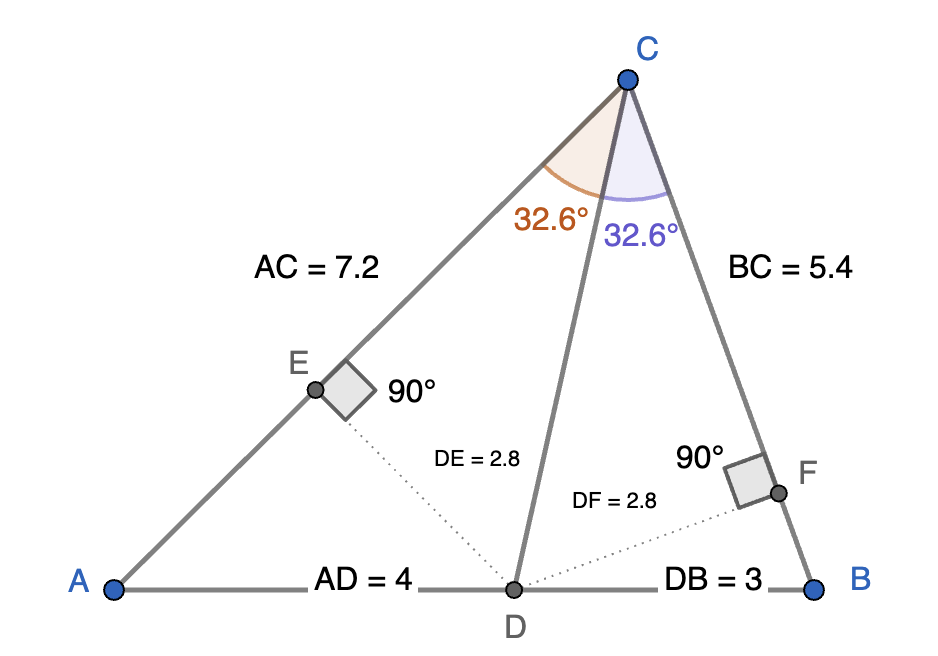

DC bisects :math:`\angle ACB` implies

.. math::

   \frac{AC}{BC}=\frac{AD}{DB}

This can be proved as follows:

.. math::

   &\Delta DCE~\text{and}~\Delta DFE~\text{are congruent (AAS test)}\implies DE=DF

   &\frac{\text{Area}~\Delta ACD}{\text{Area}~\Delta BCD}=\frac{DE\cdot AC}{DF\cdot BC}=\frac{AC}{BC}
   
   &\frac{\text{Area}~\Delta ACD}{\text{Area}~\Delta BCD}=\frac{AD}{DB}~\text{(Adjacent Triangles)}

   &\frac{AC}{BC}=\frac{AD}{DB}~\text{(From the preceding two equations)}

30-60-90 and 45-45-90 Triangles
--------------------------------

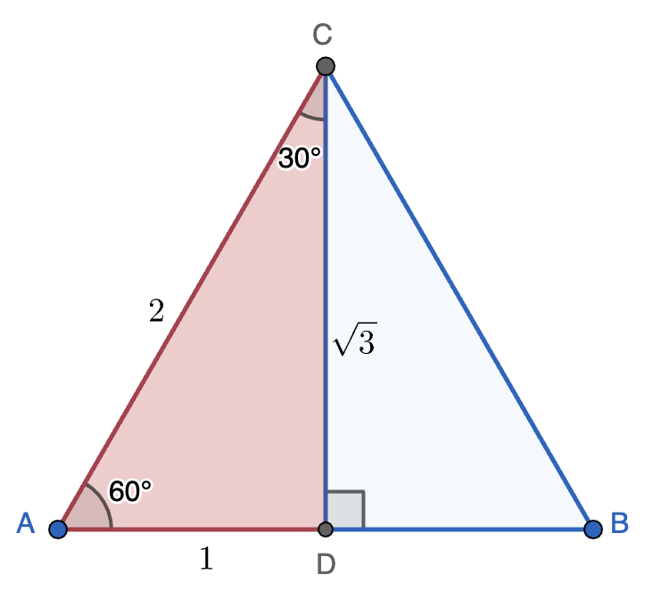

An equilateral triangle ABC of side 2 is divided into two congruent traingles with angles :math:`30^o,~60^o,~\text{and}~90^o` by the perpendicular bisector of AB. :math:`AD=DB=\frac{AB}{2}=1`. By Pythagoras theorem, :math:`CD=\sqrt{AC^2-AD^2}=\sqrt{3}`. 

Any 30-60-90 triangle will be similar to the triangle ACD. Hence, knowing any one side of such a triangle is sufficient to determine the other two sides using similarity. One could place our template above and the similar triangle that is to be solved next to each other and then figure out the scale factor for the sides.

Key point to remember:

**The side opposite 30 degrees in a 30-60-90 triangle is half of the hypotensue**

The ratio for the other leg of the right angle can then be deduced using Pythagoras theorem.

**The height of an equilateral triangle of side** :math:`s` **is, thus,** :math:`\frac{\sqrt{3}}{2}s`. **Therefore, its area is** :math:`\frac{\sqrt{3}}{4}s^2`.

=================================================

For example, in the following figure, ACD is our template and GFE is to be solved. The scale factor for the sides is :math:`k=\frac{FE}{CD}=\frac{2}{\sqrt{3}}`. Thus, :math:`GF=k\cdot AC=\frac{4}{\sqrt{3}},~GE=k\cdot AD=\frac{2}{\sqrt{3}}`. 

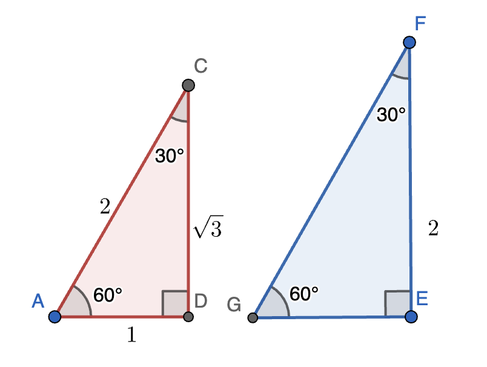

=================================================

Now consider a triangle ABC whose angles are :math:`45^o,~45^o,~\text{and}~90^o`. The sides opposite :math:`45^o` are equal. If these sides are of length :math:`1`, then the hypotenuse is of length :math:`\sqrt{2}`. This can be used as a template to solve other :math:`45-45-90` triangles similar to this template.

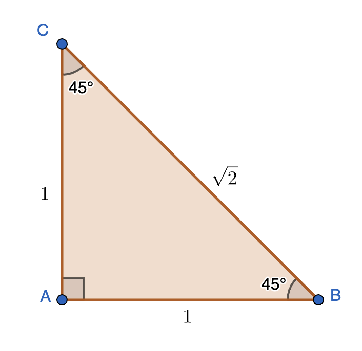

Key point to remember:

**A 45-45-90 triangle is a right-angled triangle with legs of the right-angle equal**

The side proportions can then be obtained using Pythagoras theorem.
	  

Viviani's Theorem
-------------------

**In an equilateral triangle, the sum of the distances of any interior point from the three sides is equal to the height**

Let us see why.

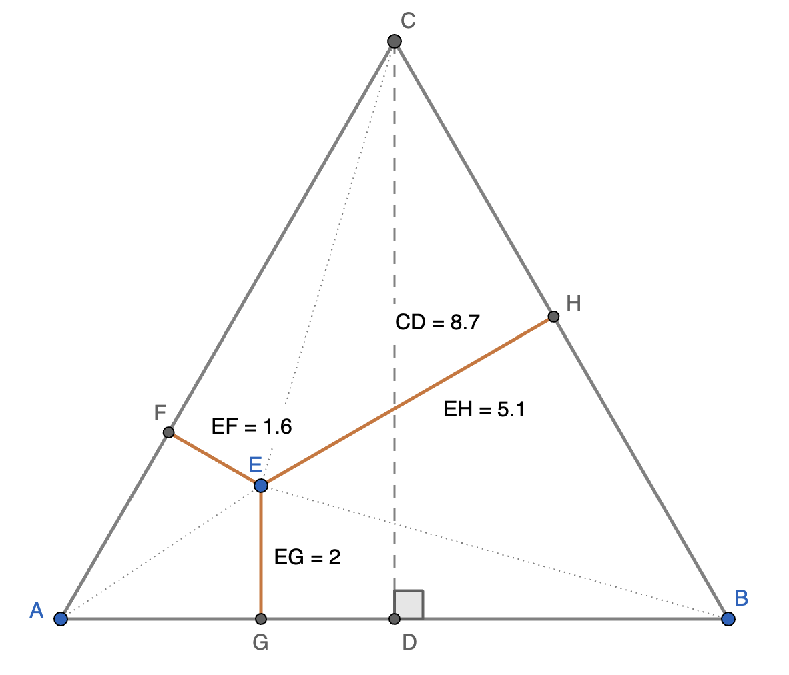

ABC is an equilateral triangle of side :math:`s`. The area of ABC computed in two different ways has to be the same.

.. math::

   \text{Area}~\Delta ABC &=\text{Area}~\Delta EBC + \text{Area}~\Delta AEC  + \text{Area}~\Delta ABE

   &=\frac{1}{2}\left(s\cdot EH+s\cdot EF+s\cdot EG\right)=\frac{s}{2}\cdot(EH+EF+EG)

   \text{Area}~\Delta ABC &=\frac{s}{2}\cdot CD

   \text{Hence,}~CD=EH+EF+EG
   

