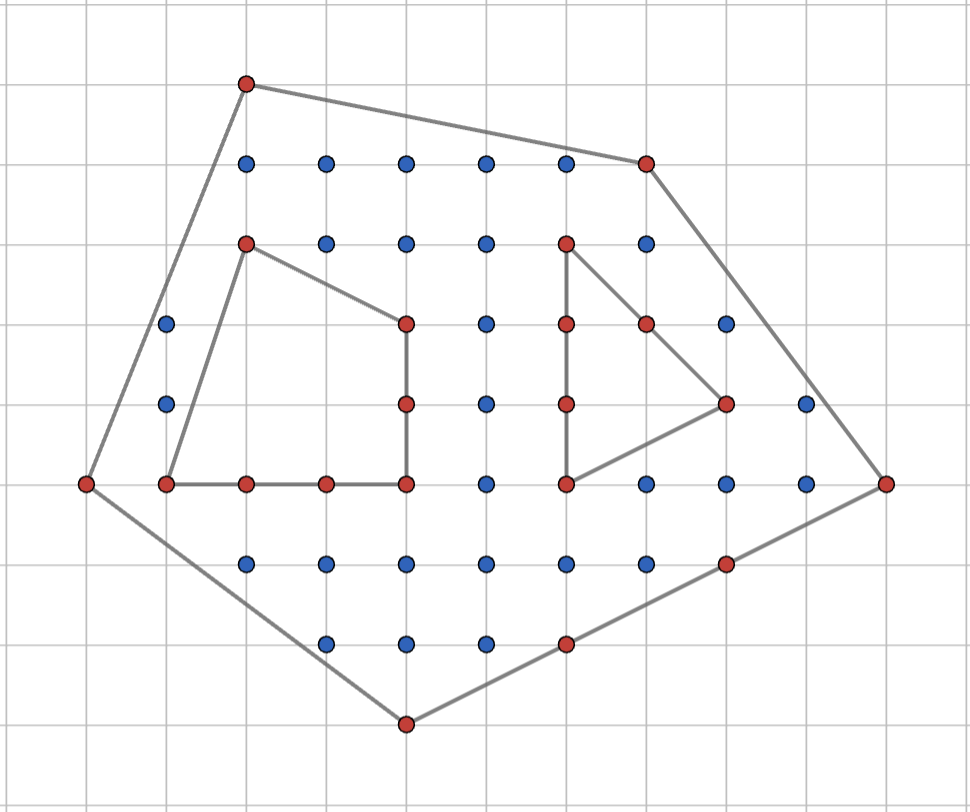
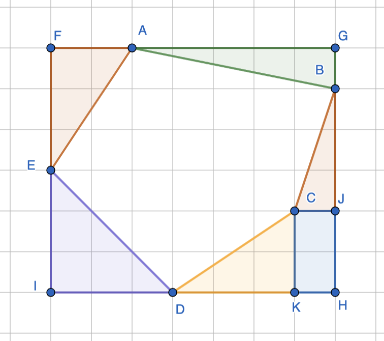

Area of polygons on a grid
======================================

Given a polygon drawn on a grid with unit spacing, find the area of the polygon.

Pick's theorem
-----------------

The figure above shows an outer polygon with two polygonal holes inside. The objective if to find the area of the polygon minus the areas of the two holes. Pick's theorem says that this area is given by

.. math::

   &A = I + \frac{B}{2} + H - 1

   &A:~\text{Area}

   &I:~\text{Number of interior grid points}

   &B:~\text{Number of boundary points}

   &H:~\text{Number of holes}

In the above image, there are 28 interior points (shown in blue), 20 boundary points (shown in red), and 2 holes. Hence, area = 28 + 20/2 + 2 - 1 = 39 square units.  

Bounding box method
----------------------

The bounding box method puts a bounding box FGHI around the polygon as shown. The area between the bounding box and the polygon is then tiled into right-angled triangles and rectangles aligned with the coordinate directions. Finding the areas of the bounding box and these tiles is straight-forward given the coordinates. The difference of the area of the bounding box and the total area of the tiles is the area of the polygon.

If there are holes in the polygon as in the case of Pick's theorem, the areas of the holes can be found using the bounding box method and the subtracted off from the area of the outer polygon.

Bounding box method is useful when the number of points to be counted for the application of Pick's theorem is large and the number of triangles/rectangles to be removed from the bounding box is small.

