Graph Theory
======================================

Shortest Path
----------------

The figure below shows a weighted graph. The nodes represent cities and the edges the roads between the cities. The weights on the edges represent distances between cities along the roads. The objective is to find the shortest distance between node 0 and all other nodes. For example, there are different choices for the roads to use to go from 0 to 8. What is the distance for the shortest path?

The algorithm used here is attributed to Djikstra.

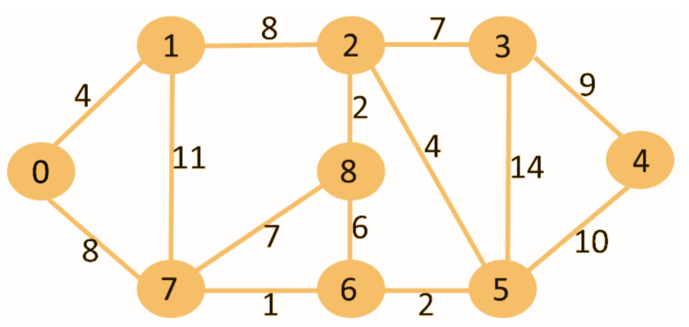

The algorithm proceeds incrementally by visiting one node at a time.

Step 1:

Start at **node 0**, note down the distances to the nodes that adjacent to node 0 (have an edge from node 0) in a table. The row highlighted in yellow shows which node is being visited in this step. More on the "From (node)" column later.

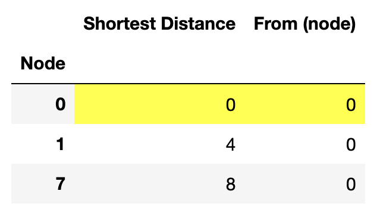
	  

	  
Step 2:

We are done with node 0. Hence, we freeze this row (no more changes allowed in this row) and change the color of node 0 row to orange to remind us that this node is done visiting. 

Next, we visit the node that had the smallest "shortest distance" from node 0 in step 1. In this case, it is **node 1** (Node 1 is at distance 4 from node 0, and node 7 is at distance 8 from node 0). Of the nodes that are not frozen, nodes 2 and 7 are adjacent to node 1. There is already a row for node 7 in the table. We create a new row for node 2.

The distance from node 0 to node 2 via node 1 is the ["shortest distance" to node 1] + [8 (the distance between nodes 1 and 2)]. This is noted in the table as the current "shortest distance" to node 2 from node 0. The adjacent node from which node 2 was reached from for this shortest distance is node 1. Hence, we note "node 1" in the "From (node)" column for this row.

For node 7, the distance from node 0 to node 7 via node 1 is 4+11=15. This is larger than the distance recorded at the shortest distance to node 7 in step 1. Hence, we leave the row for node 7 unchanged. The current "shortest distance" to node 7 is still the direct distance from node 0 that was recorded in step 0.

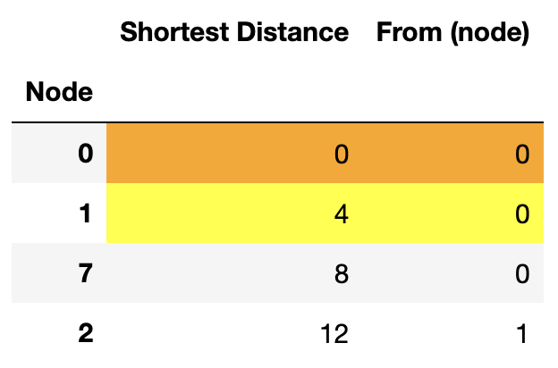

Step 3:

We are done with node 1 also. Hence, node 1 is frozen (color changed to orange). Of the remaining unfrozen nodes in the table, **node 7** has the current shortest distance from node 0. Hence, this node is visited next.

Two new rows are added to the table for nodes 6 and 8  - the nodes that are adjacent to node 7, but don't have existing rows in the table. The current "shortest distance" to node 6 is 8 (shortest distance to node 7) + 1 (distance of node 6 from node 7) = 9. Similarly, the current "shortest distance" to node 8 is 8+7=15.  The "From (node)" for both these nodes is 7 because the current "shortest distance" for these nodes is when the adjacent nodes from which these nodes are approached is node 7.

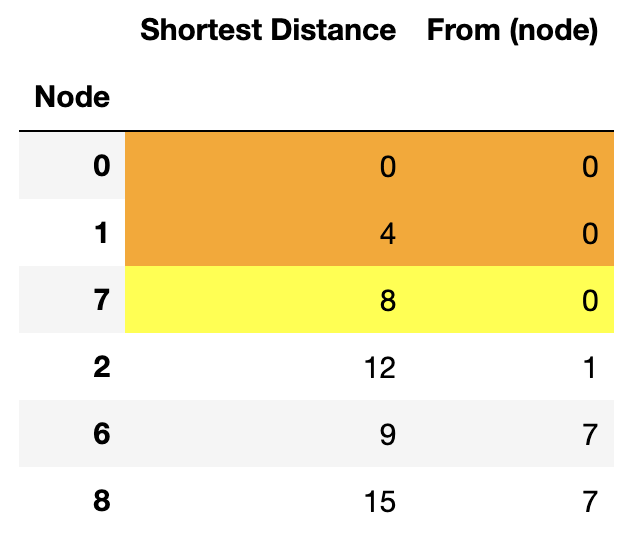

Step 4:

Node 7 is frozen. The next visited node is **node 6** - the unfrozen node with the smallest "shortest distance" in the table.

A new row is introduced for column 5.

We should also check the unfrozen nodes adjacent to 6 that already have rows in the table. If the distance from node 0 to any of these nodes via node 6 is smaller than the current "shortest distance", then the "shortest distance" for that node has to changed to this distance, and the "From (node)" columns needs to be changed to "6". In this example, the present step does not have any such nodes.

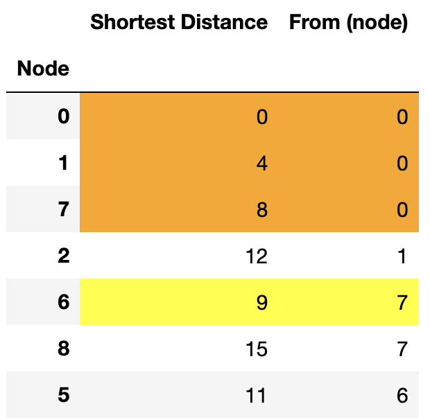

Step 5:

Node 6 is frozen. Based on the "shortest distance" in the table, **node 5** follows. New rows are added for nodes 3 and 4 - the nodes adjacent to row 5 that do not have existing rows. Existing unfrozen adjacent nodes are also checked for "shortest distance" update.

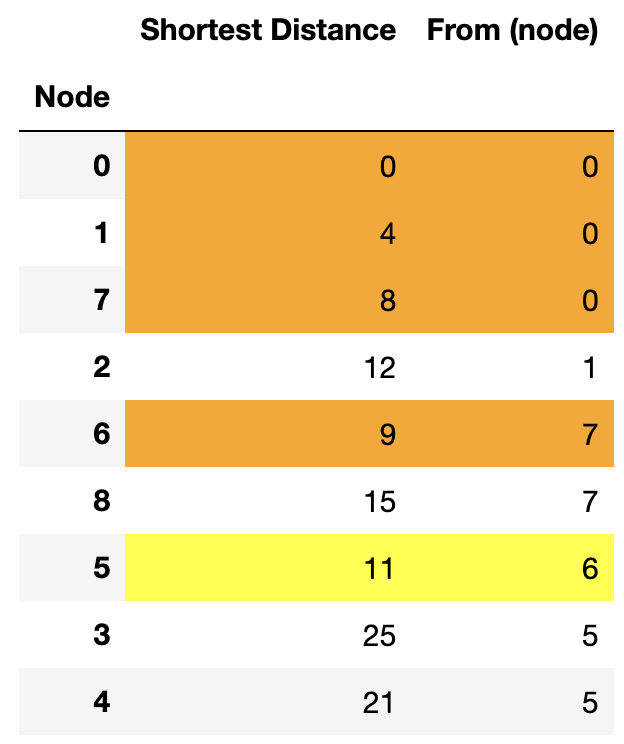

Step 6:

Node 5 is frozen. Based on the "shortest distance" in the table, **node 2** follows. All nodes have rows by this point; no new rows are added.

Of the existing unfrozen nodes adjacent to node 2, the distances to nodes 8 and 3 from node 0 via node 2 is smaller than the "shortest distance" in the table for these nodes. Hence, the "shortest distance" for these nodes is updated and the "From (node)" entry for these nodes is changed to "2" (the current shortest distance corresponds to approach of these nodes from node 2).

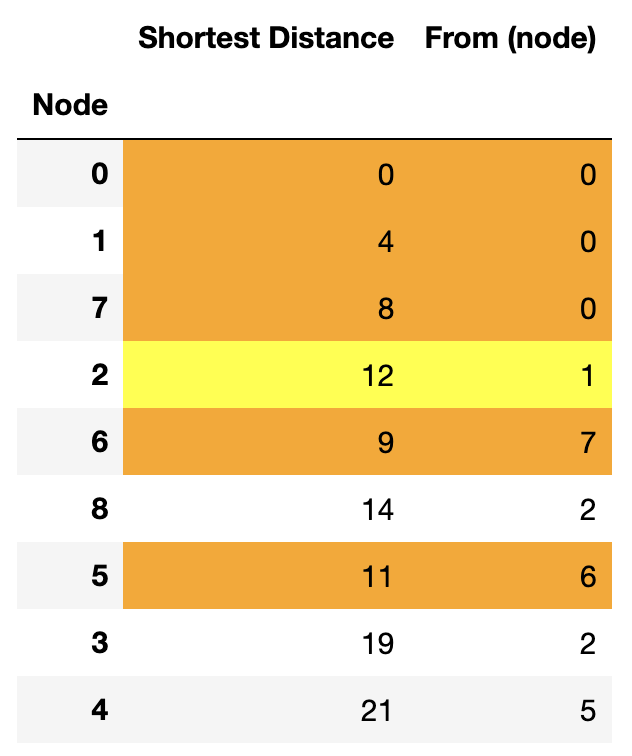

Step 7:

Node 2 is frozen and **node 8** is visited. No distance updates are needed (as the distances to adjacent nodes via node 8 is larger than the current "shortest distance").

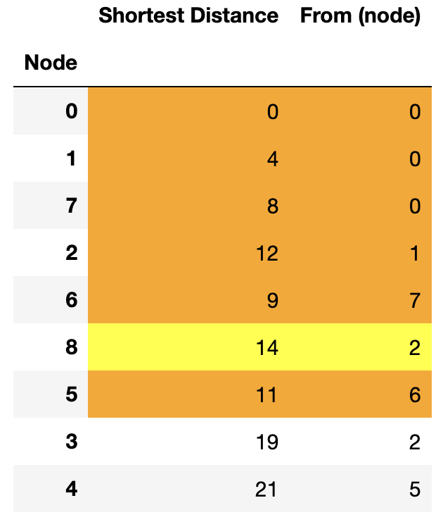

Step 8:

Node 8 is frozen and **node 3** is visited. No distance updates in this step.

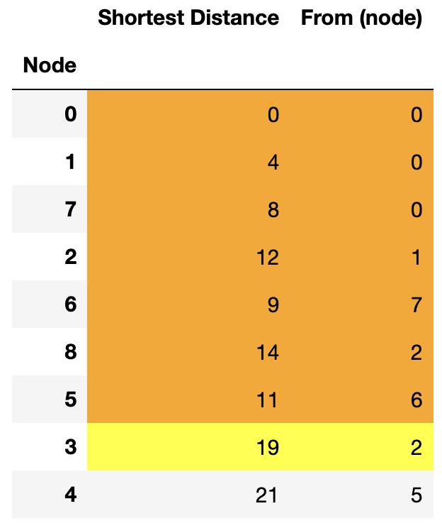

Step 9:

Node 3 is frozen and **node 4** is visited. No distance updates in this step.

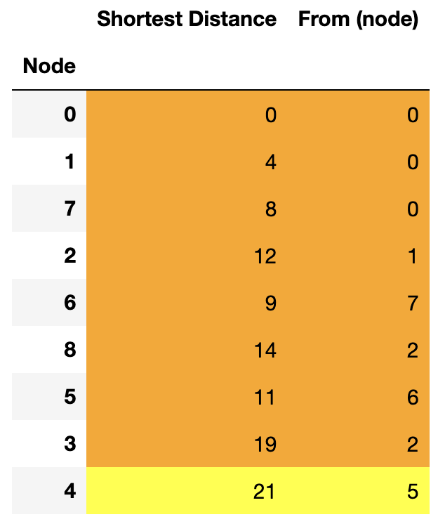

Step 10:

Node 4 is frozen. We are done as all nodes are frozen. The "shortest distance" columns now gives the shortest distance to these nodes from node 0. The "From (node)" gives the adjacent nodes the approach from which corresponds to the shortest distance.

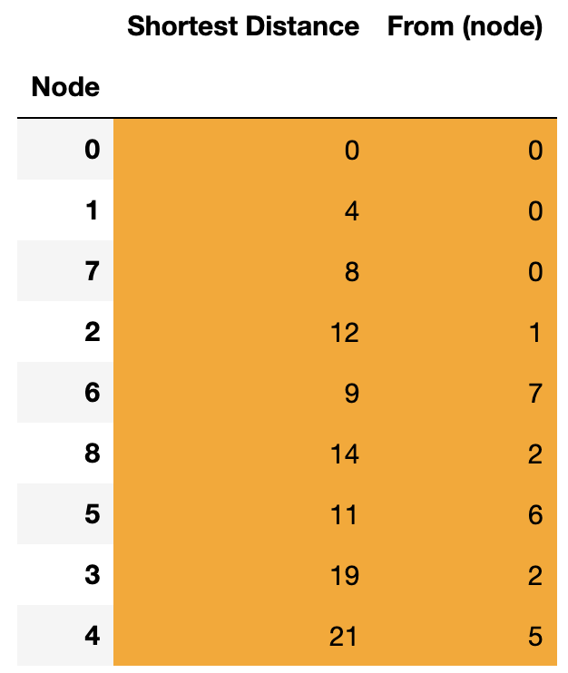

The table shows that the shortest distance to node 4 from node 0 is 21. **The path which gives this shortest distance can be obtained by looking at the "From (node)" columns and working out the path backwards**. Node 4 is approached from node 5, node 5 is approached from node 6, node 6 is approached from node 7, and node 7 is approached from node 0. Hence the path corresponding to the shortest distance is 0->7->6->5->4.

======================================

**If, at any step, there are multiple candidates for the next node to be visited as they have the same "shortest distance" that is the smallest among unfrozen nodes, then any one of those multiple candidates can be chosen as the next node.**

======================================

The above algorithm works for directed graphs as well (graphs where the edges are one-way). Only those nodes that have edges directed from the node being visited to them are considered as adjacent nodes while updatng rows or adding new rows.

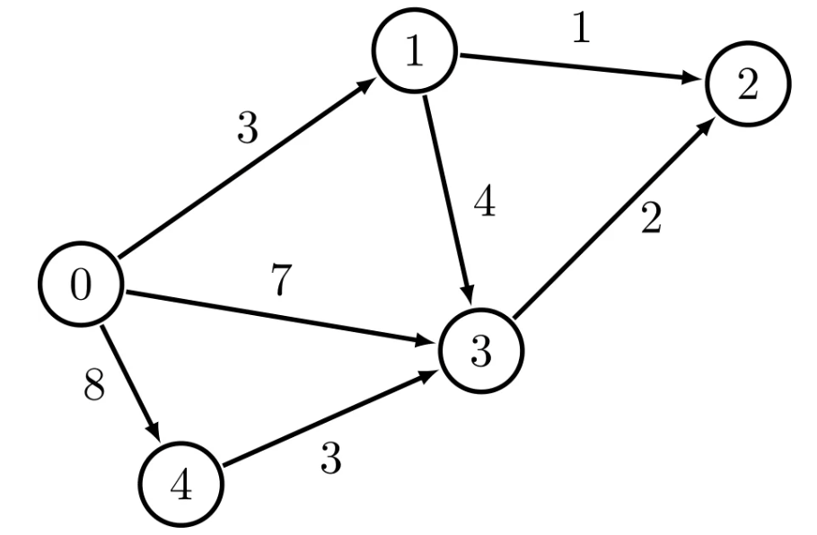

In the above graph, suppose nodes 2 and 4 are unfrozen while visiting node 3, node 2 is considered for updating. However node 4 is not as the edge between 3 and 4 points from 4 to 3, and not 3 to 4.
	  
	  
Minimum Spanning Tree
-----------------------

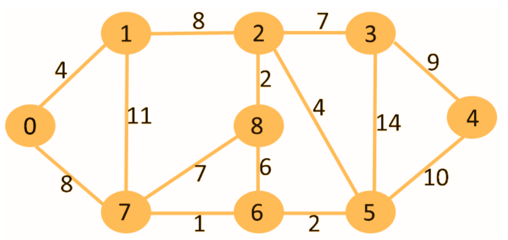

As opposed to finding the shortest distance, we are now interested in building a road network to connect the cities. The weights on the edges show the cost to build a road between the two cities connected by the edge.

The objective is to minimize the total cost to build the road network while having all the cities connected (to have the ability to drive from any city to any other city). We are trying to a get rid of unwanted roads and reduce the cost. THis network will have no cycles (no closed loops). Such graphs are called "trees" as they look like trees with branches. Hence we are looking to find the "minimum spanning tree" - a tree that spans all nodes and is minimal in the sense of cost.

The recipe is to take successive steps removing one edge at a time until no further edge removal is possible. At every step the edge with the highest cost is removed **whose removal still keeps the cities connected** that is the graph does not break up into two disjoint graphs.

Step 1:

Remove edge 3-5. It is the costliest edge (with cost 14) and its removal still keeps the cities connected. So the edge is redundant in the network.

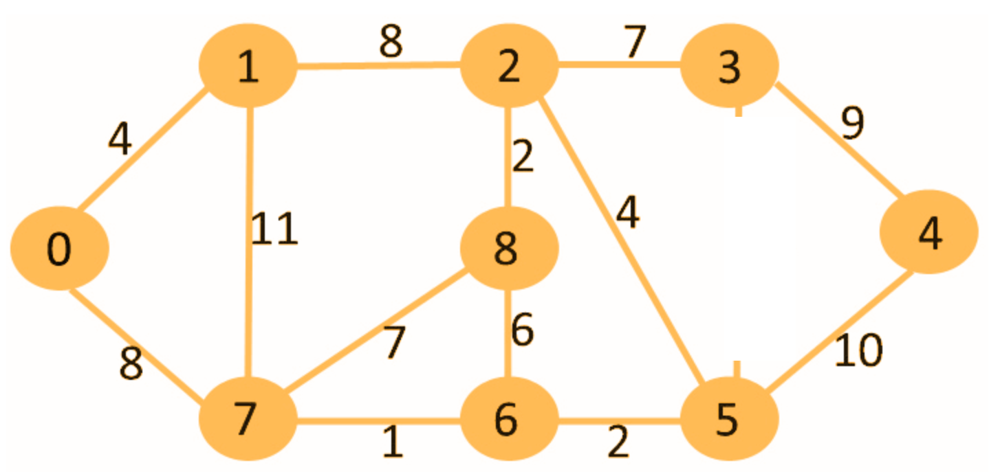

Step 2:

Remove the costliest edge remaining - edge 1-7 (with cost 11). Removal of this edge still keeps the cities connected.
	  
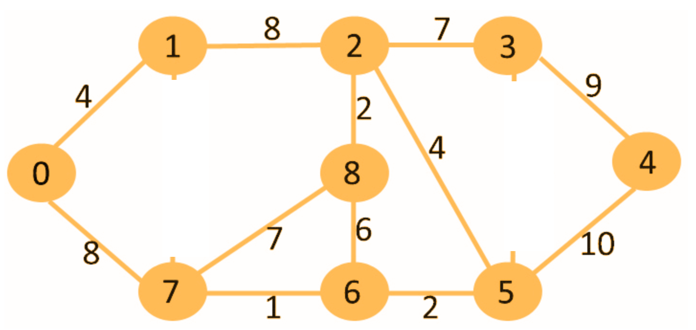

Step 3:

Remove edge 5-4 (with cost 10)

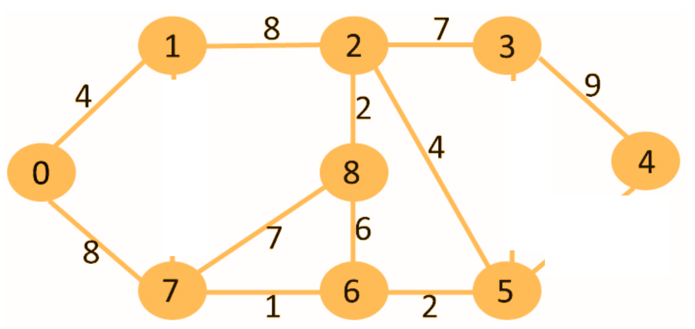
	  
Step 4:

Edge 3-4 is the costliest remaining edge with a cost of 9. However, removal of this edge leaves node 4 unconnected to the other nodes. So this edge is not redundant and cannot be removed.

Next, we have two edges - edge 1-2 and edge 0-7 - with code of 8. Either one of the edges can be removed without breaking the graph into disjoint parts. We arbitrarily decide to remove edge 1-2.

Choosing to remove edge 0-7 will result in a different final minimum spanning tree. However the total cost of that tree will be the same as the tree that is being created by our choice.
	  
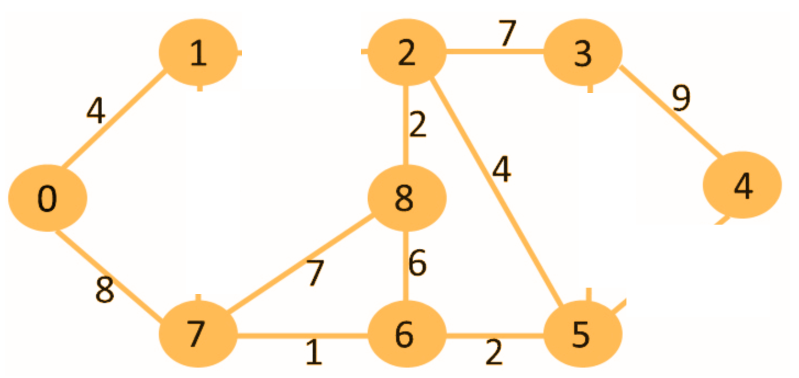

Step 5:

Next, we have two costliest edges - edges 2-3 and 7-8 - with the same cost - 7. It can be seen that edge 2-3 is not redundant. Its removal will disconnect nodes 3 and 4 from the rest. However, edge 7-8 is redundant. Hence we remove edge 7-8.

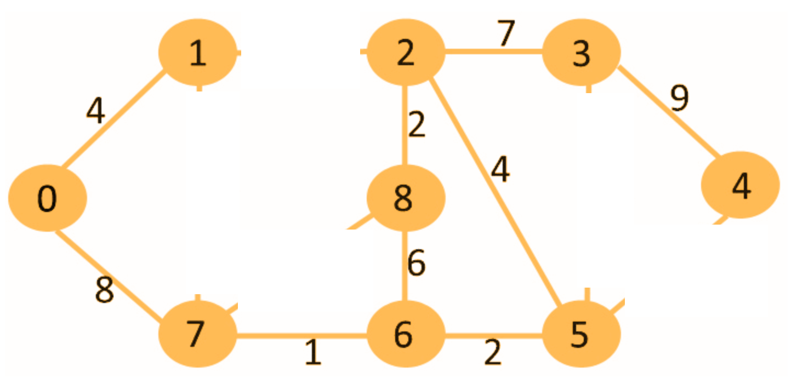

Step 6:

Edge 6-8 is removed.

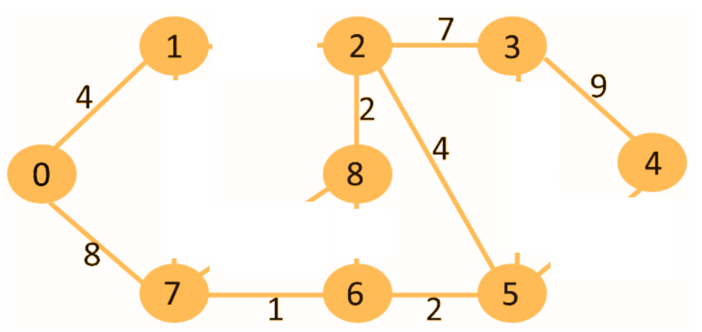

It can be seen that removal of any other edge in this final graph will make some cities inaccessible from the other. Hence, we are done with the edge-removal (also known as "pruning") steps.

======================================

There could be more than one minimum spanning trees for a graph. This can happen if there are two "edge" candidates with equal cost to be removed at any stage. Depending on which edge is chosen to be removed, the final minimum spanning tree could look different. However, the total cost of the network for all these minimum spanning trees will be the same.

Eulerian Circuits and Trails
------------------------------

"Konigsberg bridge problem" is a classic problem that comes up in every introductory discussion of Eulerian paths. 

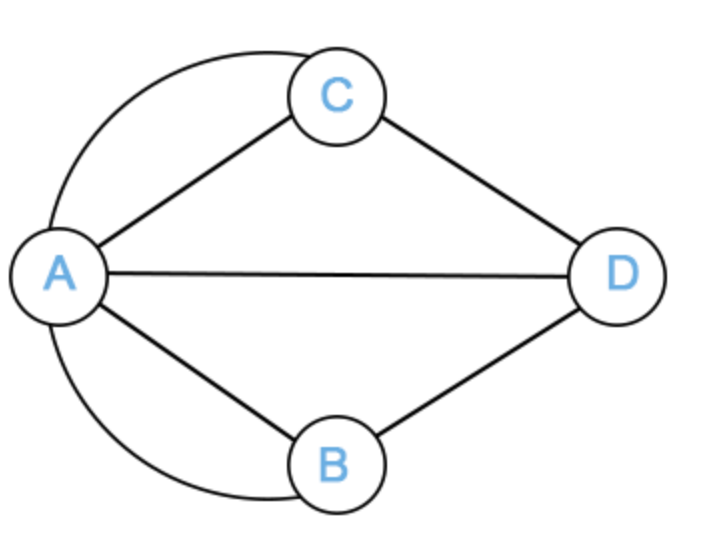

Konigsberg was a city in Prussia (present-day Kaliningrad, Russia) that had two opposite banks on the river Pregel and two islands in the river. These two banks and the islands were connected by seven bridges. In the image above, A and B are the two river banks, C and D are the two islands, and the graph edges represent the seven bridges.

The question is whether it is possible to start at a node, traverse all the edges (bridges in Konigsberg), each edge exactly once, and return to the starting node. In other words, draw all the edges of the graph using a pencil without lifting the pencil from the paper or retracing an edge. Such a path is called **"Eulerian circuit"**. Note, the condition is on traversing every edge only once. It is ok to go through a node more than once.

The answer is that this is "impossible" for the Konigsberg graph. Euler proved it in 1736.

======================================

How about other graphs? Which undirected graphs have Eulerian circuits?

**A graph has an Eulerian circuit if and only if all nodes have even degrees and all the nodes with nonzero degree are connected**

The degree of a node is the number of edges attached to the node.

Intuitively, at any node, for every edge that acts as the entry edge, there has to be a different edge that acts as an exit edge. Thus, there needs to be pairs of entry-exit edges at each node.

======================================

Now instead of having the starting node being the same as the ending node, what happens if the starting node and ending nodes are different? We still need to draw all edges without lifting the pencil and without retracing any edge. Incidentally, the path in this case is called an **"Eulerian trail"**.

**A graph has an Eulerian trail if and only if two nodes have odd degree and the nodes with nonzero degree are connected**

The intuition is similar to the one for Eulerian circuit except that the starting node can have one exit edge without a corresponding entry edge as the trail starts at this node, and the ending node can have one entry edge without a corresponding exit edge as the trail stops at this node.

Graph Coloring
-----------------

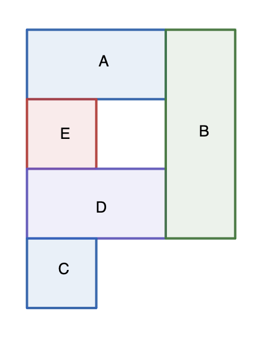

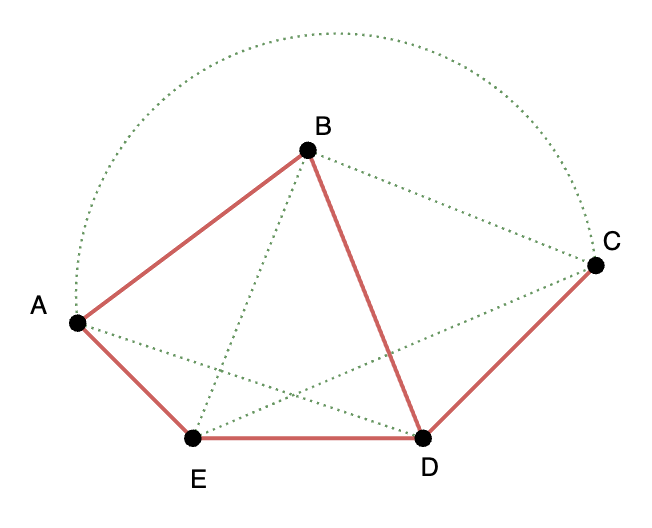

The left image shows the layout of a house with 5 rooms. The rooms are to be painted in such a way that **no** adjacent rooms are painted in the same color.

Th right image shows the equivalent graph. Rooms that cannot be painted in the same color are connected by red edges; rooms that can be (not should be) be painted in the same color are connected by green edges. The red and green edges put together form a complete graph (every node connected to every other node). Thus, there are :math:`C(5,2)=10` total edges.

**How many ways are there to color the rooms if 5, 4, 3, or 2 colors are available?**

======================================

**Case 1: 5 colors**

Attempt 1:

Start with an arbitrary node (say node B in this example). There are 5 color choices for node B.

Move to node adjacent to an already colored node (say node D). There are 4 color choices for node D (all colors except the one chosen for node B)

Continue the iterations. Move to node E. 4 color choices for E (all colors except the one chosen for node D). Note that the color assigned to node B can be reused here as E is connected to node B by a green edge, not a red edge.

Move to node A. **The number of choices depends on whether nodes B and E have the same color or different colors. Hence, we much distinguish those cases upfront.**

Let us try this again.

======================================

Attempt 2:

**Case 1: 5 colors**

**Case 1A: B and E should have the same color**

Choice for B -> 5 colors. This fixes the color of E as well.

Choice for D -> 4 (all colors except the one chosen for B and E)

Choice for A -> 4 (all colors except the one chosen for B and E)

Choice of C -> 4 (all colors except the one chosen for D)

**Case 1B: B and E should have different colors**

Choice for B -> 5

Choice for D -> 4 (all colors except the one chosen for B)

Choice for E -> 3 (all colors except the ones chosen for B and D)

Choice for A -> 3 (all colors except the ones chosen for B and E)

Choice of C -> 4 (all colors except the one chosen for D)

**Total number of ways = 5 x 4 x 4 x 4 + 5 x 4 x 3 x 3 x 4 = 5 x 4 x 4 x ( 4 + 3 x 3) = 1040**

======================================

**Case 2: 4 colors**

**Case 1A: B and E should have the same color**

Choice for B -> 4 colors. This fixes the color of E as well.

Choice for D -> 3 (all colors except the one chosen for B and E)

Choice for A -> 3 (all colors except the one chosen for B and E)

Choice of C -> 3 (all colors except the one chosen for D)

**Case 1B: B and E should have different colors**

Choice for B -> 4

Choice for D -> 3 (all colors except the one chosen for B)

Choice for E -> 2 (all colors except the ones chosen for B and D)

Choice for A -> 2 (all colors except the ones chosen for B and E)

Choice of C -> 3 (all colors except the one chosen for D)

**Total number of ways = 4 x 3 x 3 x 3 + 4 x 3 x 2 x 2 x 3 = 4 x 3 x 3 x ( 3 + 2 x 2) = 252**

======================================

**Case 3: 3 colors**

**Case 1A: B and E should have the same color**

Choice for B -> 3 colors. This fixes the color of E as well.

Choice for D -> 2 (all colors except the one chosen for B and E)

Choice for A -> 2 (all colors except the one chosen for B and E)

Choice of C -> 2 (all colors except the one chosen for D)

**Case 1B: B and E should have different colors**

Choice for B -> 3

Choice for D -> 2 (all colors except the one chosen for B)

Choice for E -> 1 (all colors except the ones chosen for B and D)

Choice for A -> 1 (all colors except the ones chosen for B and E)

Choice of C -> 2 (all colors except the one chosen for D)

**Total number of ways = 3 x 2 x 2 x 2 + 3 x 2 x 1 x 1 x 2 = 3 x 2 x 2 x ( 2 + 1 x 1) = 36**

======================================

**Case 4: 2 colors**

**Case 1A: B and E should have the same color**

Choice for B -> 2 colors. This fixes the color of E as well.

Choice for D -> 1 (all colors except the one chosen for B and E)

Choice for A -> 1 (all colors except the one chosen for B and E)

Choice of C -> 1 (all colors except the one chosen for D)

**Case 1B: B and E should have different colors**

Choice for B -> 2

Choice for D -> 1 (all colors except the one chosen for B)

Choice for E -> 0 (all colors except the ones chosen for B and D)

We got a 0 multiplier. So no need to continue case 1B.

**Total number of ways = 2 x 1 x 1 x 1 = 2**

Clearly the painting cannot be done with 1 color. **Hence, the minimum number of colors needed to color this graph is 2. It is called the "chromatic number" of the graph**.

A complete graph with n nodes will need n colors. Hence, the chromatic number of a complete graph with n nodes is n.

