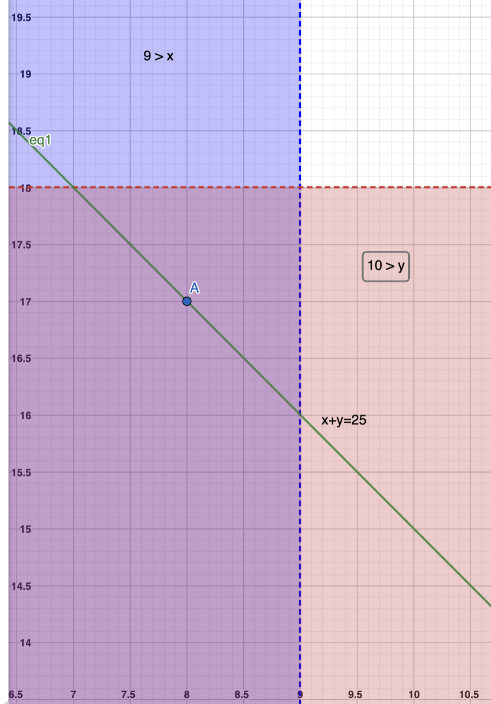
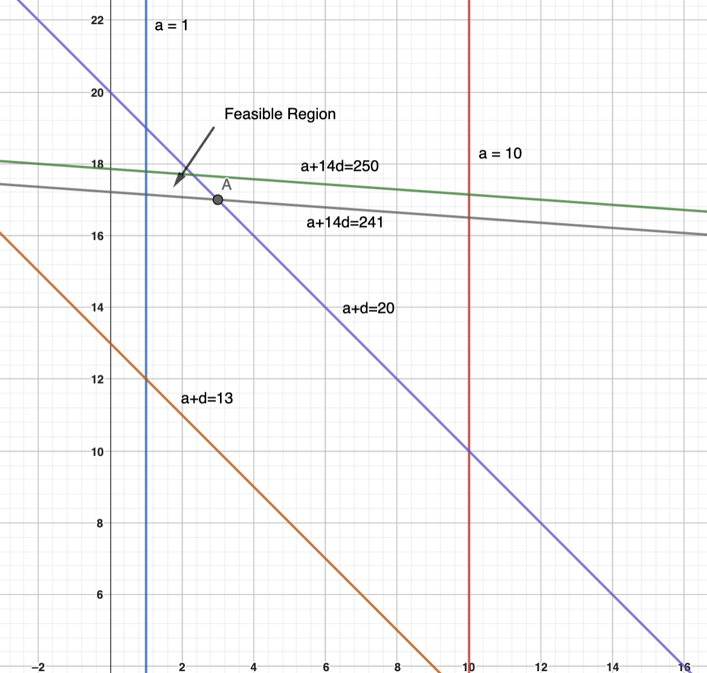

Two variable inequalities
======================================

Steph scored 15 baskets out of 20 attempts in the first half of a game, and 10 baskets out of 10 attempts in the second half. Candace took 12 attempts in the first half and 18 attempts in the second. In each half, Steph scored a higher percentage of baskets than Candace. Surprisingly they ended with the same overall percentage of baskets scored. How many more baskets did Candace score in the second half than in the first?

.. math::

   & x:~\text{Number of baskets Candace scores in half 1}

   & y:~\text{Number of baskets Candace scores in half 2}

   & \frac{15}{20} > \frac{x}{12} \implies 9 > x

   & \frac{10}{10} > \frac{y}{18} \implies 18 > y
   
   & x + y = 25 

In the above figure, the line x+y=25 is shown. The blue and the red regions correspond to 9 > x and 18 > y, respectively. Thus, the only point with integer coordinates that lies on the line, and is in both - the blue and the red - regions is point A with coordinates (8,17).
  
=======================================

Fifteen integers :math:`a_1, a_2, a_3, \ldots, a_{15}` are arranged in order on a number line. The integers are equally spaced and have the property that :math:`1\leq  a_1 \leq 10,~13 \leq a_2 \leq 20,~241 \leq a_{15}\leq 250`. What is the sum of digits of :math:`a_{14}` ?

.. math::

   & a:~\text{First term}

   & d:~\text{Common difference}
   
   & a_1 = a

   & a_2 = a+d

   & a_{15} = a+14d

   & a_{14} = a+13d

   &--------------

   &  1\leq a \leq 10

   &  13\leq a+d \leq 20

   & 241\leq a+14d \leq 250

   &--------------

The lines corresponding the equalities are shown. The feasible region (the region that satisfies all the inequalities) is shown by the arrow. Note: The boundaries of this region are also feasible. The only point with integer coordinates in the feasible region is point A with coordinates (3,17).

Hence :math:`a_{14}=a+13d=3 + 13\times 17 = 224`.	  

Answer: 2 + 2 + 4 = 8

   
