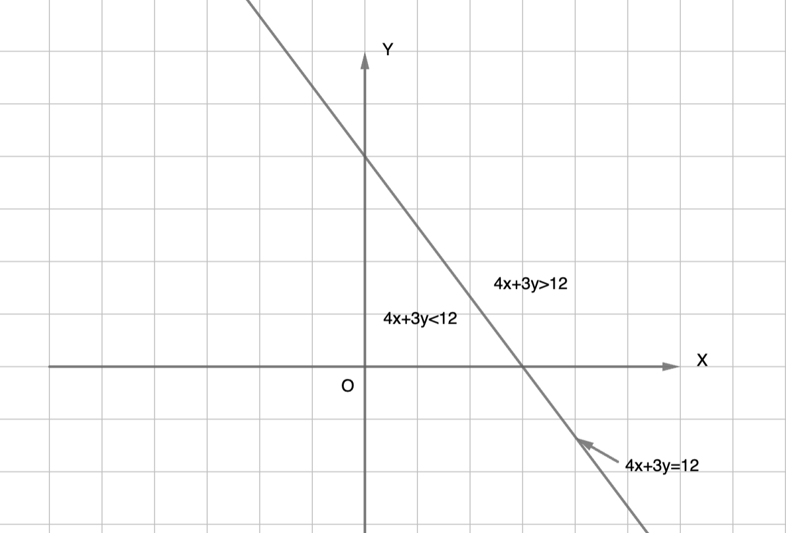
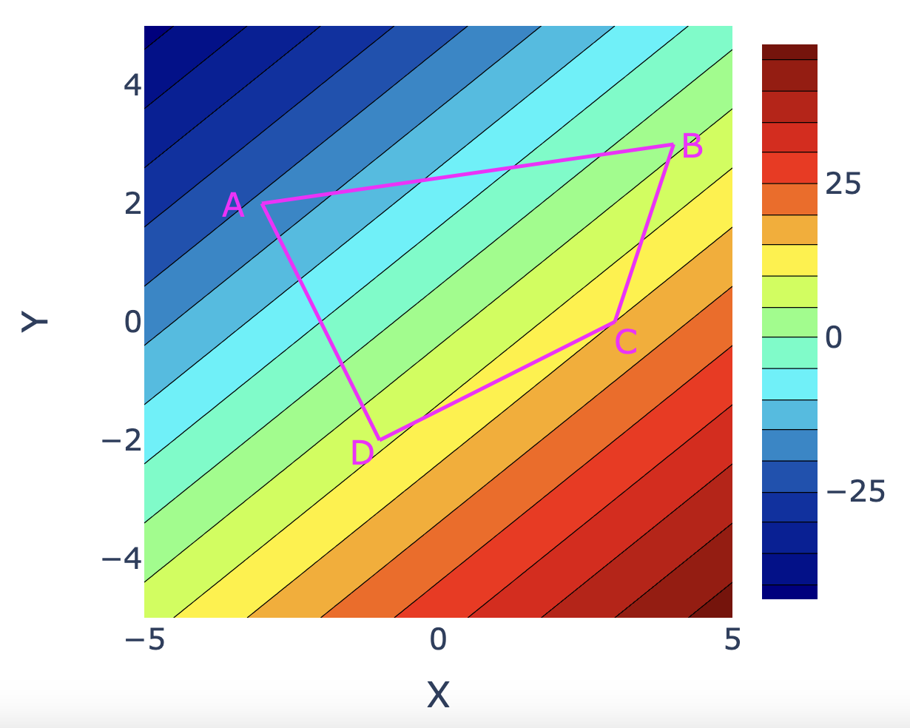
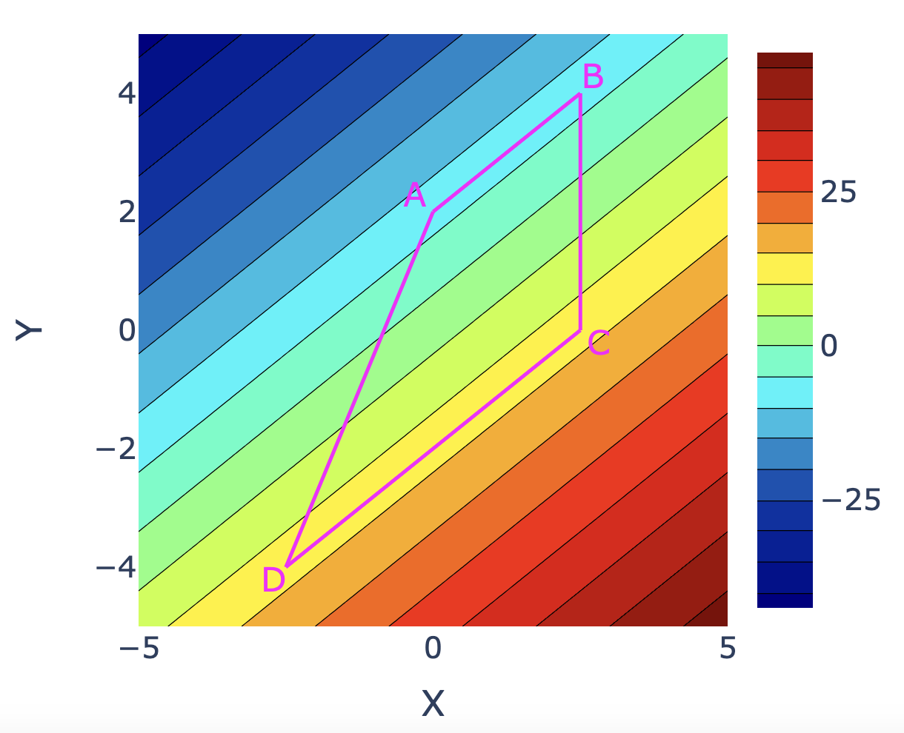

Linear Function
======================================

Line trough two points
-------------------------

Given two non-coincident points :math:`(x_1,y_1)` and :math:`(x_2,y_2)`, find the equation of the line through the two points.

If :math:`x_1=x_2`, then the equation is :math:`x=x_1`.

Else, if :math:`y_1=y_2`, then the equation is :math:`y=y_1`.

In the general case, where neither of the above two special cases are true, the equation of the line through the points is given by

.. math::

   \frac{y-y_1}{y_2-y_1}=\frac{x-x_1}{x_2-x_1}

Basically, the slope between :math:`(x_1,y_1)` and an arbitrary point on the line :math:`(x,y)` has to be equal to the slope between :math:`(x_1,y_1)` and :math:`(x_2,y_2)`.

Perpendicular lines
-----------------------

**Two perpendicular lines have the product of their slopes equal to -1**

.. math::

   & y = m_1x+c_1

   & y = m_2x+c_2

   & m_1 \times m_2 = -1

Linear inequality
-----------------------

Consider an inequality of the form :math:`4x+3y>12`.

The straight line :math:`4x+3y=12` divides the XY plane into two regions, one where :math:`4x+3y<12` and the other where :math:`4x+3y>12`.

The easiest way to find out which side of the line corresponds to ">" and which side to "<" is to plug in some test values of (x,y) to find out.

In the above case, (0,0) gives 4(0)+3(0)=0. Thus, the side of the line that contains the origin corresponds to :math:`4x+3y<12`.

Maximization/Minimization
---------------------------

The figure above shows the contour plot for a linear function

:math:`f(x,y)=4x-5y+3`.

For every value of (x,y), the color shows the value of f(x,y). The contours are straight lines along which the function takes a fixed value. **The objective is to find the maximum or minimum value of the function on or inside the polygon ABCD.**

As can be seen from the figure, the smallest value of the function over the polygon occurs at point A and the largest value occurs at point C.

The figure below shows another case where the polygon edges AB and CD align with the contours of the function. In this case, the largest value of the function over the polygon happens along CD and the smallest value along AB.
	  

**In both cases, the largest and smallest value of the function can be obtained by just checking the value of the function at the vertices of the polygon. There is no need to check the value of the function at any other points of the polygon.**

**Thus the maximum and minimum vaue of a linear function over a polygon occur at the vertices of the polygon**
   
