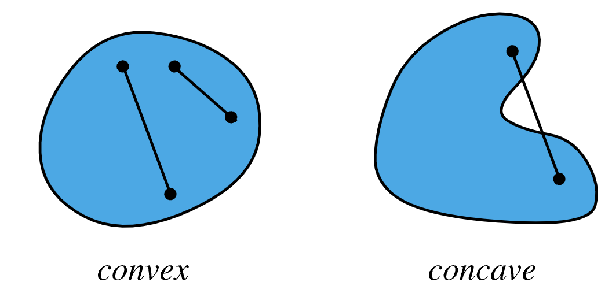
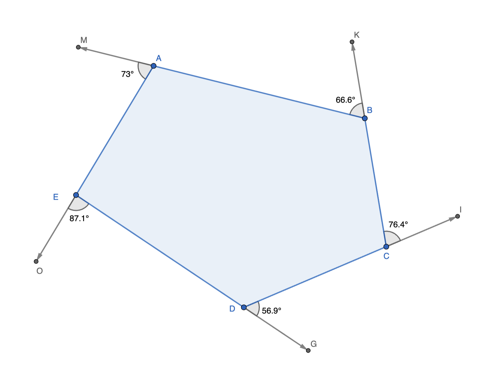
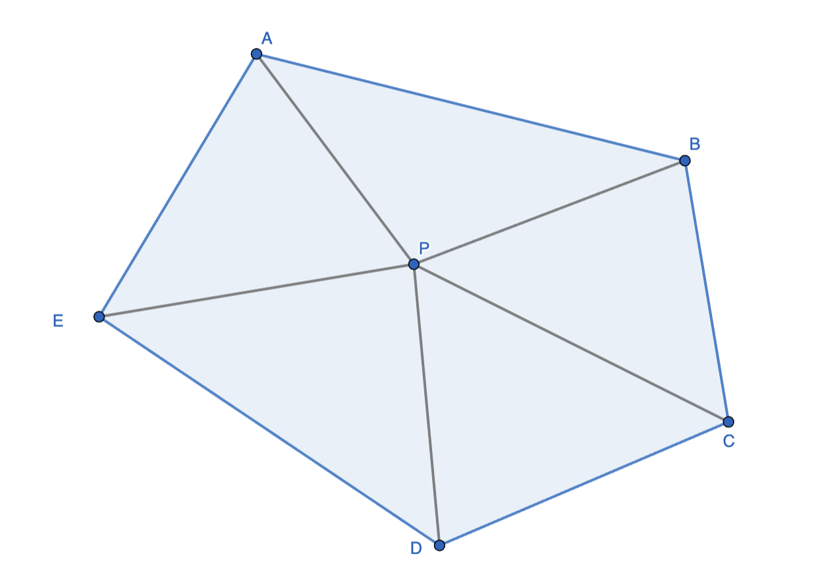
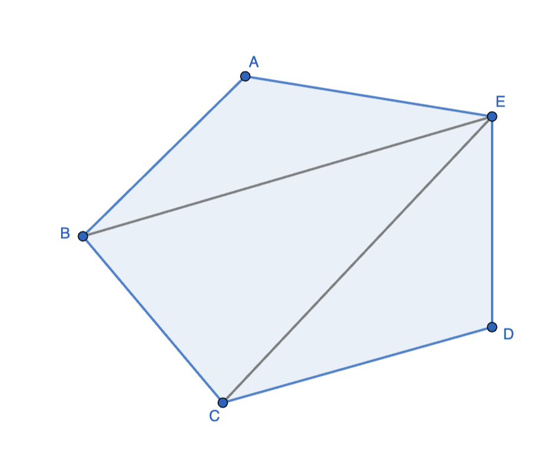
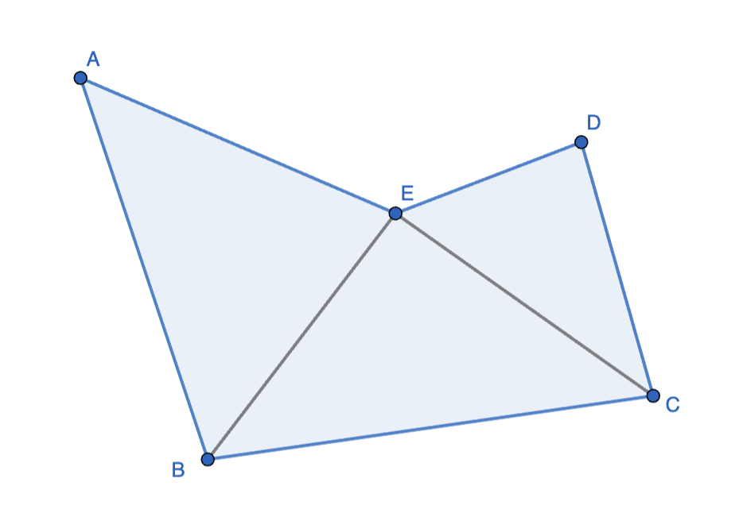
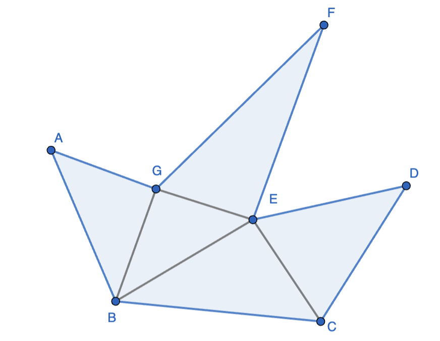
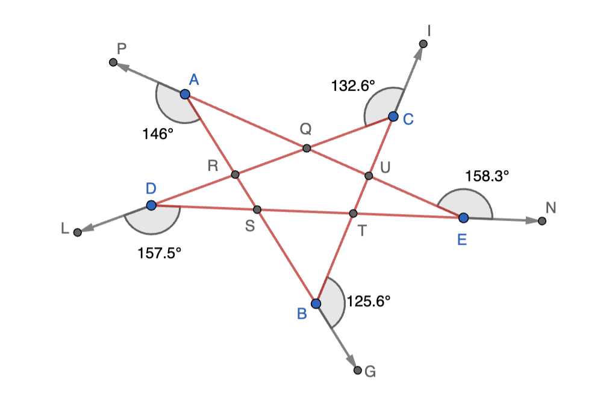
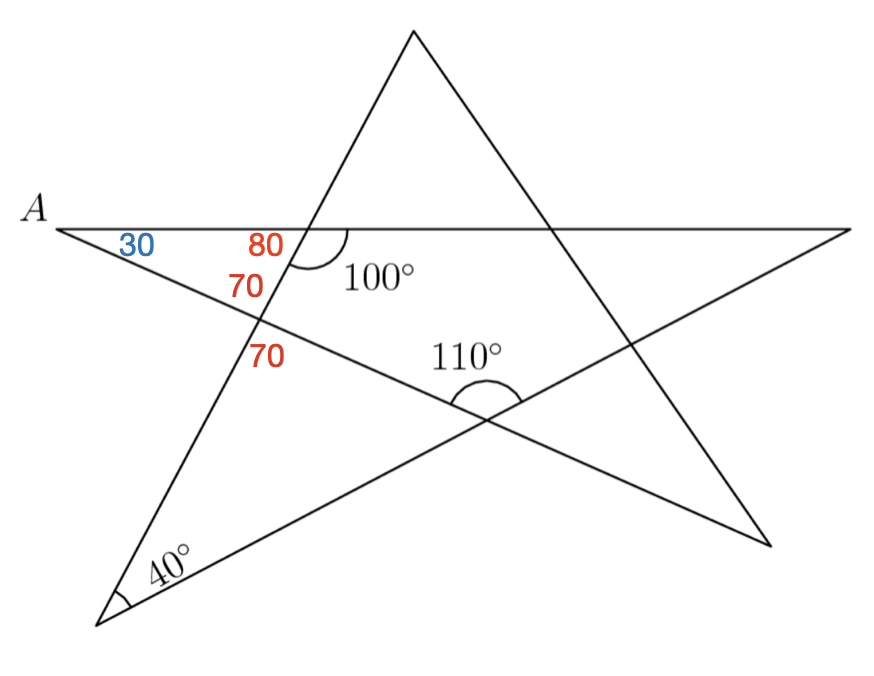
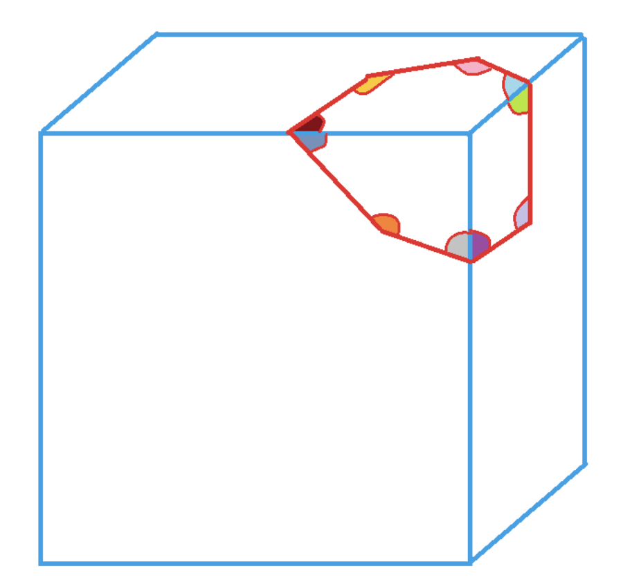

Angles in a polygon
======================================

A region such that all the line segments between any two points of the region stay inside the region is called a convex region.

A region that is not convex is non-convex or concave. In the second image above, a line segment is shown between two points of the region that is outside the region for some finite length.

Convex polygons in a plane
------------------------------

The figure above shows exterior angles of a convex polygon. These exterior angles add up to :math:`360^o`. This can be seen from the following: ray DG is rotated left and translated to become ray CI, ray CI is then rotated left and translated to become ray BK. Continuing this process, eventually ray EO is rotated left and translated to become ray DG. Thus, ray DG goes through one full rotation of :math:`360^o` while going through the series of rotations i.e. the series of exterior angles. Thus, the exterior angles add up to :math:`360^o`. The angles supplementary to each of these exterior angles are the interior angles. Thus, if there are :math:`n` interior/exterior angles, then the sum of the interior angles equals :math:`(180\times n-360)^o=(n-2)\times 180^o`.
	  
======================================

The same result can be obtained using the figure above. There are :math:`n` interior angles, sides, and triangles. The sum of the interior angles is the sum of the angles of all triangles minus the :math:`360^o` at the center. Thus, the sume of the interior angles is :math:`(n-2)\times 180^o`.

======================================

A third way of getting the same result is by tesselating the interior into :math:`n-2` triangles thereby getting :math:`(n-2)\times 180^o` for the sum of the interior angles.
	  
	  
Non-convex polygons in a plane
---------------------------------

From the above two images, it can be seen that the same contruct and the same formula holds for non-convex polygons as well.

The argument of exterior angles adding up to :math:`360^o` for convex polygons does not work for this case because not all turns are in the same sense, there are left turns and right turns. 
	  
Stars
---------------------------------

Interestingly, an equivalent of the :math:`360^o` argument for convex polygons works for stars. In the above figure, the rays are rotates/translated as follows: BG -> CI -> DL -> EN -> AB -> BG. In doing these rotations, for this particular star, we have made **two complete rotations**. Hence the exterior angles add up to :math:`720^o`. The interior angles at the star corners are supplementary to these exterior angles. Hence, the interior angles add up to :math:`(5\times 180 - 720)^o=180^o`. The :math:`5` is for the number of exterior and interior corner angles. Note that the interior angles of convex pentagon QRSTU follows the formula derived earlier :math:`(n-2)\times 180^o=3\times 180^o=540^o`. The angles AQC, CUR, ETB, BSD, DRA are angles vertically opposite to the interior angles of pentagon QRSTU. Hence, these add up to :math:`540^o`.
	  
======================================

Here is a problem involving the star geometry that can be solved using basic geometry instead of any of the matter discussed so far about angles in polygons. THe angles written in black font are given. The objective is to find interior angle A.

The angles written in red can be deduced using angle chasing via exterior angle/supplementary angle arguments. Thus, interior angle A is :math:`30^o`.

	  
Convex polygons on polyhedra
-------------------------------

Here is a variant of the convex polygon interior angle sum problem discussed above. The convex polygon (heptagon) is at the corner of a polyhedron (in this case a cube). The objective is to find the sum of the planar colored angles. We join the vertrices of the polygons to the corner of the cube. Thus, we have 7 triangles whose angles add up to :math:`7\times 180^o`. However, instead of subtracting :math:`360^o` at the central point, here we need to subtract :math:`270^o` as th center contributes three right angles - one on each of three faces of the polyhedron that the corner shares. Thus, the sum of the colored planar angles is :math:`(7\times 180-270)^o=990^o`.

