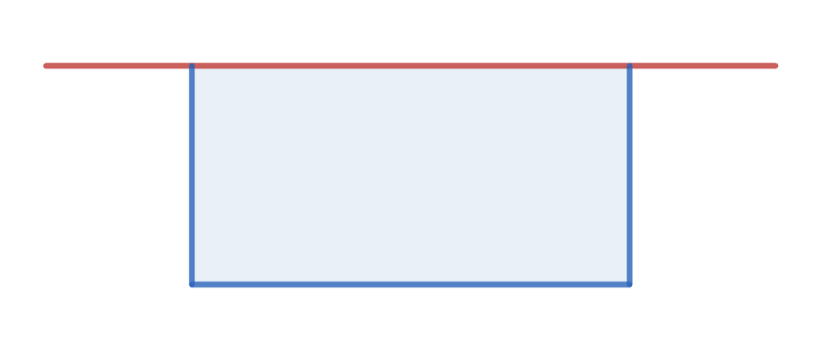

Practice Problems (set B)
===============================

`P1 <https://artofproblemsolving.com/wiki/index.php/2020_AMC_8_Problems/Problem_22>`_

`P2 <https://artofproblemsolving.com/wiki/index.php/2020_AMC_8_Problems/Problem_21>`_

`P3 <https://artofproblemsolving.com/wiki/index.php/2019_AMC_8_Problems/Problem_13>`_

`P4 <https://artofproblemsolving.com/wiki/index.php/2019_AMC_8_Problems/Problem_25>`_

`P5 <https://artofproblemsolving.com/wiki/index.php/2014_AMC_8_Problems/Problem_22>`_

`P6 <https://artofproblemsolving.com/wiki/index.php/2014_AMC_8_Problems/Problem_24>`_

`P7 <https://artofproblemsolving.com/wiki/index.php/2013_AMC_8_Problems/Problem_24>`_

`P8 <https://artofproblemsolving.com/wiki/index.php/2012_AMC_8_Problems/Problem_22>`_

`P9 <https://artofproblemsolving.com/wiki/index.php/2011_AMC_8_Problems/Problem_23>`_

`P10 <https://artofproblemsolving.com/wiki/index.php/2023_AMC_8_Problems/Problem_14>`_

`P11 <https://jwilson.coe.uga.edu/emat6680fa05/schultz/6690/pick/pick_main.htm>`_

`P12 <https://artofproblemsolving.com/wiki/index.php/2008_AMC_8_Problems/Problem_21>`_

`P13 <https://artofproblemsolving.com/wiki/index.php/2008_AMC_8_Problems/Problem_22>`_

`P14 <https://artofproblemsolving.com/wiki/index.php/2024_AMC_8_Problems/Problem_23>`_

`P15 <https://artofproblemsolving.com/wiki/index.php/2020_AMC_8_Problems/Problem_25>`_

`P16 <https://artofproblemsolving.com/wiki/index.php/2018_AMC_8_Problems#Problem_19>`_

`P17 <https://artofproblemsolving.com/wiki/index.php/2024_AMC_8_Problems#Problem_22>`_

`P18 <https://artofproblemsolving.com/wiki/index.php/2024_AMC_8_Problems#Problem_23>`_

`P19 <https://artofproblemsolving.com/wiki/index.php/2024_AMC_8_Problems#Problem_24>`_

`P20 <https://artofproblemsolving.com/wiki/index.php/2024_AMC_8_Problems#Problem_25>`_

==================================

Kellie makes tables and chairs. Kellie profits $20 from a table, and $10 from a chair. A table requires 15 board feet of wood, while a chair requires 4 board feet of wood. Kellie has 70 board feet available. The maximum number of tables and chairs Kellie can make in any one day is 12. What is the maximum profit Kellie can make in one day?

==================================

What is the sum of the prime numbers which are factors of 111111?

==================================

2025 consecutive integers sum to exactly 2025. What is the largest of those integers?

==================================

A standard 20-sided die is an icosahedron, where all faces are congruent triangles. How many edges and vertices does it have?

==================================

How many different positive integer cent values cannot be achieved exactly using unlimited postage stamps worth 6, 7, and 9 cents?

==================================

:math:`n=\overline{abcde6}` and :math:`4n=\overline{6abcde}`. :math:`n=?`

==================================
      
The half-angle of a cone is 45 degrees. Find the ratio of the volume of the largest sphere that can be inscribed in the cone to the volume of the cone.

==================================

The surface area of a rectangular prism is 2400. What is the largest volume the rectangular prism can have?

==================================

A farmer has an existing fence in his farm shown by the red line below. He needs to create an enclosure for his animals using a fence 60 m long. He places the fence along the blue border. What is the maximum enclosure area in square m possible?

==================================
	  
The ages of three friends are a, b, and c. Given that

.. math::

   a+b+c = \frac{1}{a}+\frac{1}{b}+\frac{1}{c},

find the range of the ages of the three friends.

==================================

The surface area of a triangular pyramid whose base is an equilateral triangle is fixed. What should be ratio of the height of the pyramid to the side of the equilateral triangle to maximize its volume?

