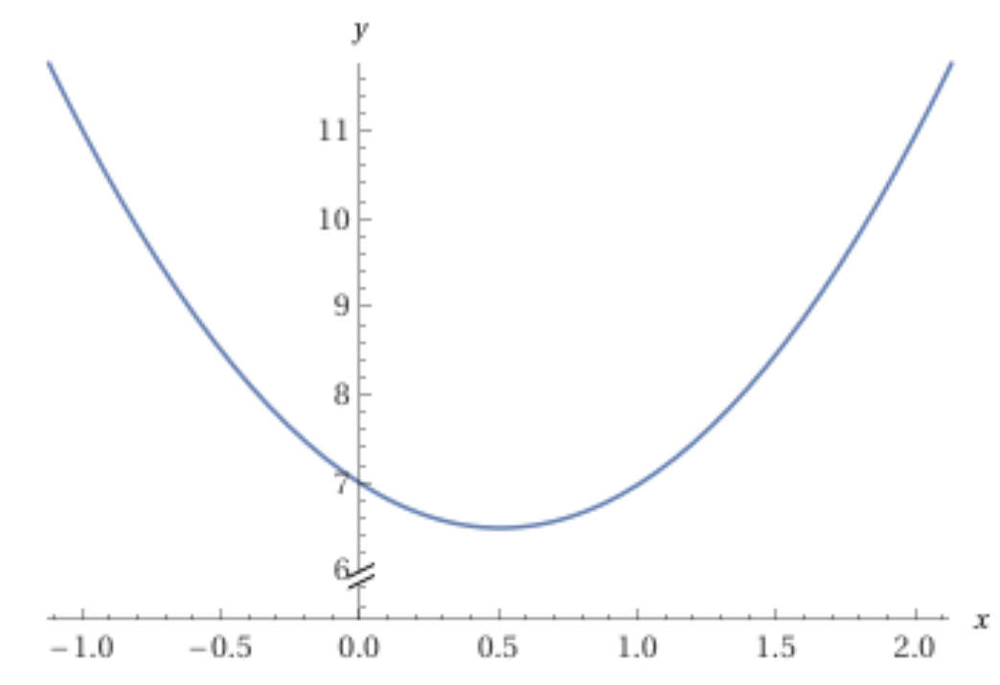
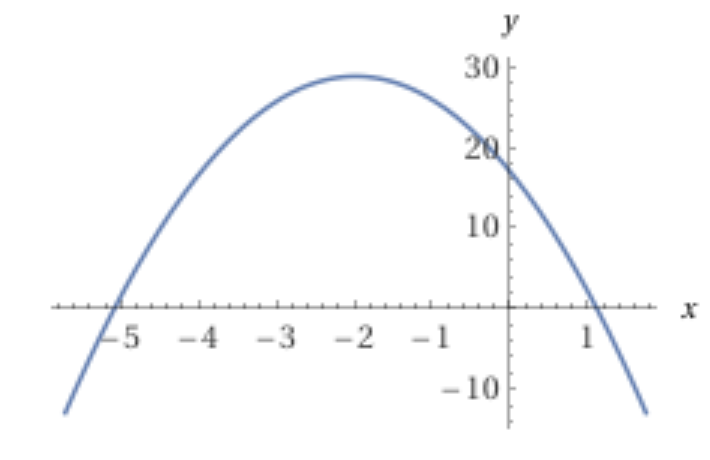

Maximizing/Minimizing Quadratic Functions 
===========================================

A general quadratic function can be written as :math:`y=ax^2+bx+c`.

If :math:`a>0`, then the graph of this function is a parabola that opens up (in the positive Y direction). Thus, the function has a minimum value. If :math:`a<0`, then the parabola opens down and the function has a maximum value.

.. math::

   y &= ax^2+bx+c

     &= a\left(x+\frac{b}{2a}\right)^2+d

   \text{where}&

   d &=c-\frac{b^2}{4a}

The minumum or the maximum happens when the square term :math:`\left(x+\frac{b}{2a}\right)^2` takes a minimum value of 0, that is, when

 .. math::

    x=-\frac{b}{2a}

The minimum/maximum value can be obtained by plugging this value of :math:`x` in :math:`ax^2+bx+c`.

Examples:

===========================================

:math:`y=2x^2-2x+7`

Minimum at :math:`-\frac{b}{2a}=\frac{2}{4}=\frac{1}{2}`

Minumum value :math:`2\left(\frac{1}{2}\right)^2-2\left(\frac{1}{2}\right)+7=\frac{13}{2}`

===========================================

:math:`y=-3x^2-12x+17`

Minimum at :math:`-\frac{b}{2a}=-\frac{12}{6}=-2`

Minumum value :math:`-3(-2)^2-12(-2)+17=29`

===========================================
	 
Calculus is intentionally avoided here.
