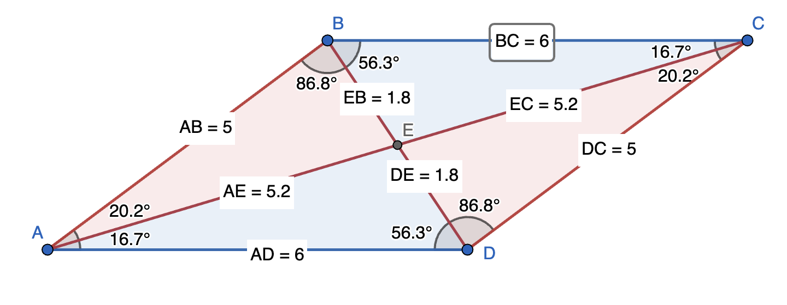
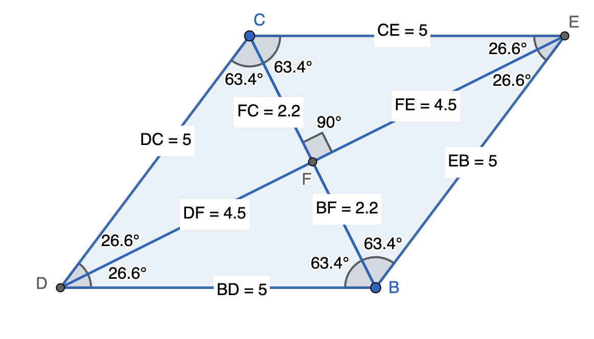
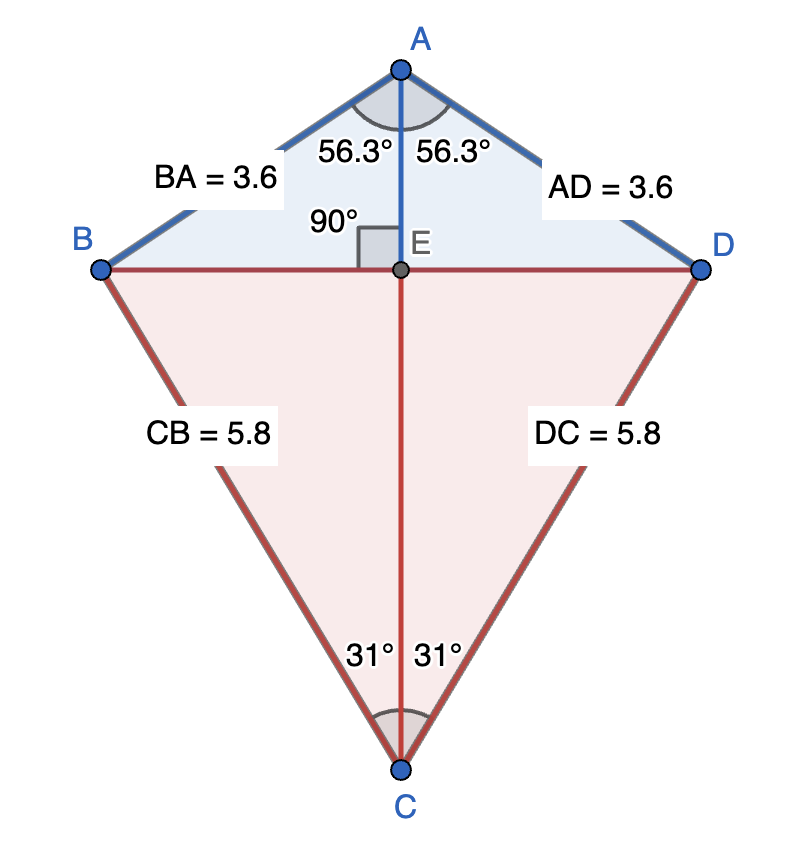
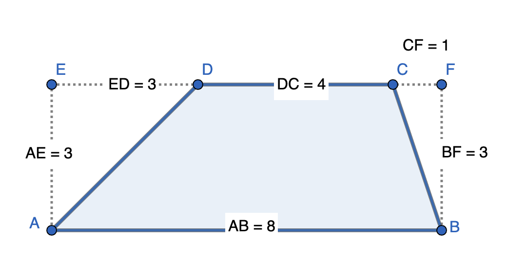

Quadrilaterals
======================================

Parallelogram
---------------

* Opposite sides are parallel

* Diagonals bisect each other (Converse is also true. If diagonals of a quadrilateral bisect each other, then the quadrilateral is a parallelogram.)

* The two red triangles are congruent and the two blue triangles are quadrilateral

* Area of the parallelogram is twice the area of triangle ABC or twice the area of triangle ABD

A rectangle is a parallelogram with all angles right angles

Rhombus
---------------

Rhombus is parallelogram with all sides equal

* Diagonals bisect each other (as rhombus is also a parallelogram)

* Diagonals are perpendicular to each other

* Diagonals are angle bisectors of the angles

* All four blue triangles are congruent right-angled triangles

* Area is four times the area of any one of the four right-angled triangles. Hence,

.. math::

   \text{Area of rhombus}=\frac{d_1\times d_2}{2}

where :math:`d_1` and :math:`d_2` are the two diagonals.

A square is also a rhombus

* Square is a rhombus with all angles right angles

* Square is a rhombus with both diagonals equal. If :math:`s` is a side of a square and :math:`d` is the diagonal, then

.. math::

   \text{Area of square}=s^2=\frac{d^2}{2}\implies d=s\sqrt{2}
	  

Kite
---------------

A kite is a quadrilateral that has mirror symmetry about one of the diagonals.

* Diagonals are perpendicular to each other

* The diagonal that forms the mirror axis (AC) bisects the other diagonal (BD).

* The blue sides are equal and the red sides are equal

* The blue triangles are congruent and the red triangles are congruent

* The area is two times the sum of the blue triangle (ABE) and the red triangle (CBE)

Trapezoid
---------------

A trapezoid is a quadrilateral with one pair of opposite sides parallel. In the figure below AB and DC are parallel.

.. math::

   &\text{Area of trapezoid}=\text{Area  of rectangle ABFE}-\text{Area of triangle EAD}-\text{Area of triangle BFC}

   &=AE(ED+DC+CF)-\frac{1}{2}\cdot AE(ED)-\frac{1}{2}\cdot AE(CF)

   &=AE\left(\frac{ED}{2}+DC+\frac{CF}{2}\right)

   &=\frac{AE}{2}\left[\left(ED+DC+CF\right)+DC\right]

   &=AE\left(\frac{AB+DC}{2}\right)

Thus, **Area of trapezoid = Average of the two parallel sides x Distance between the parallel sides**.

	  
If AD = BC, then the trapezoid is called an isosceles trapezoid. In that case, :math:`\angle DAB=\angle CBA`.

