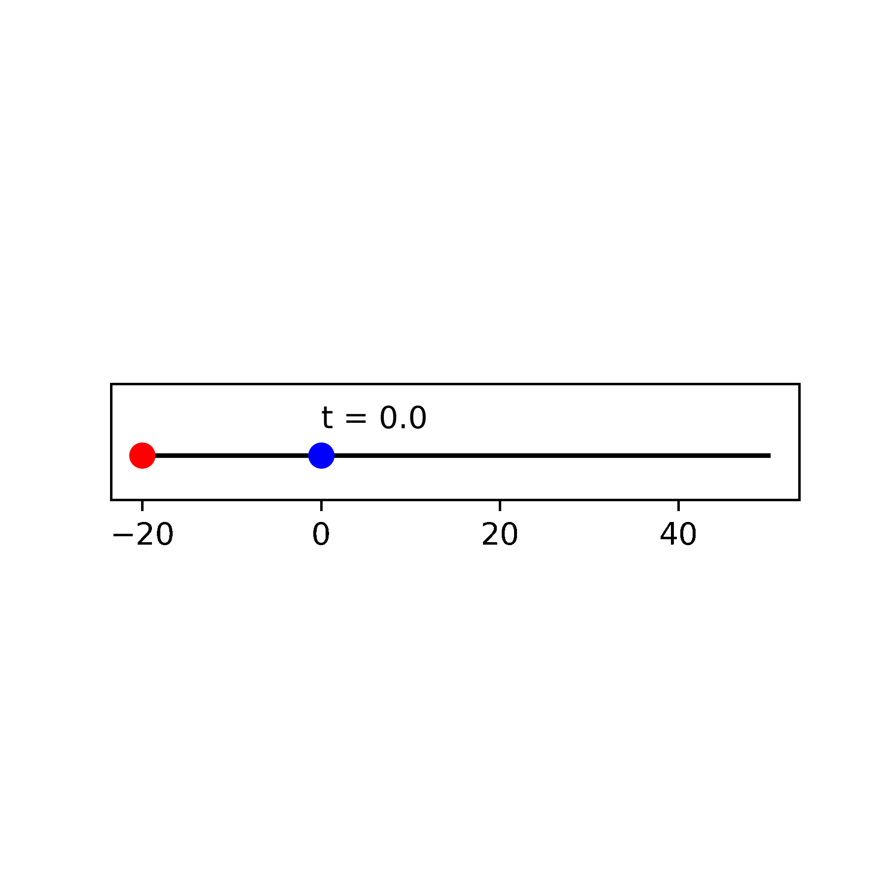
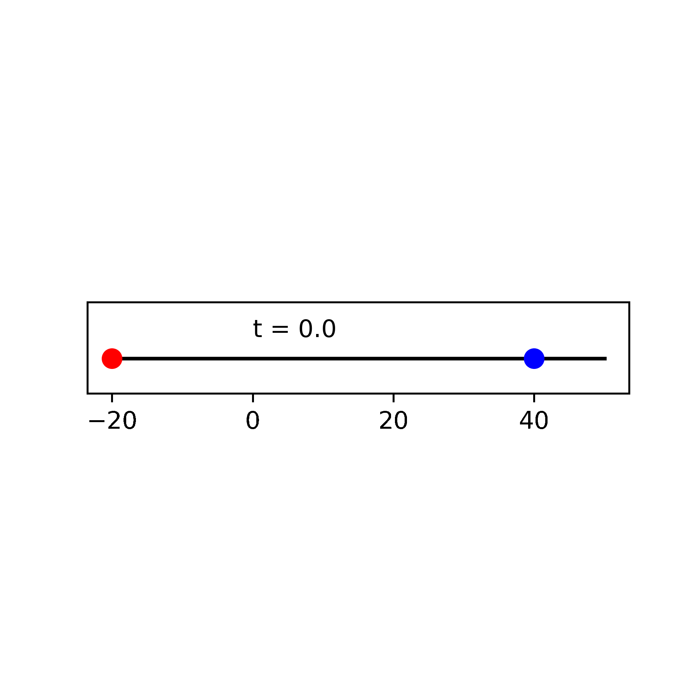
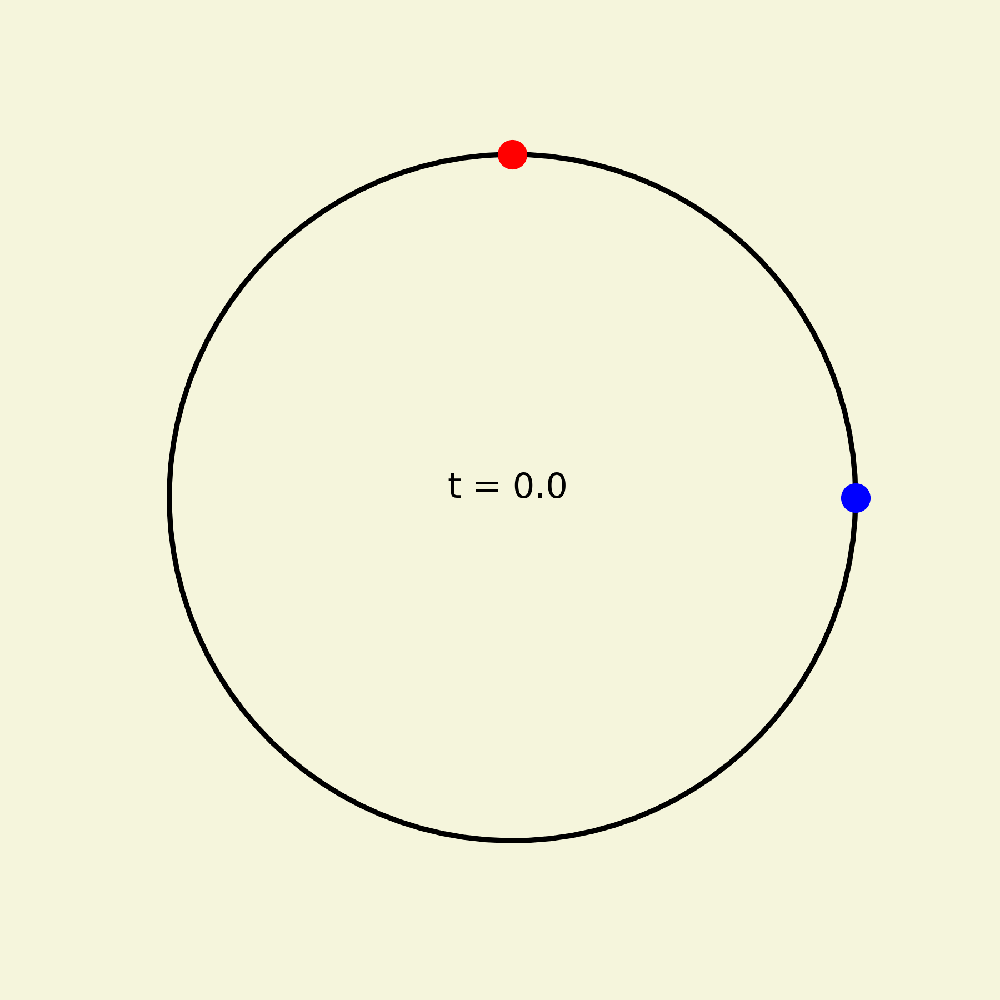
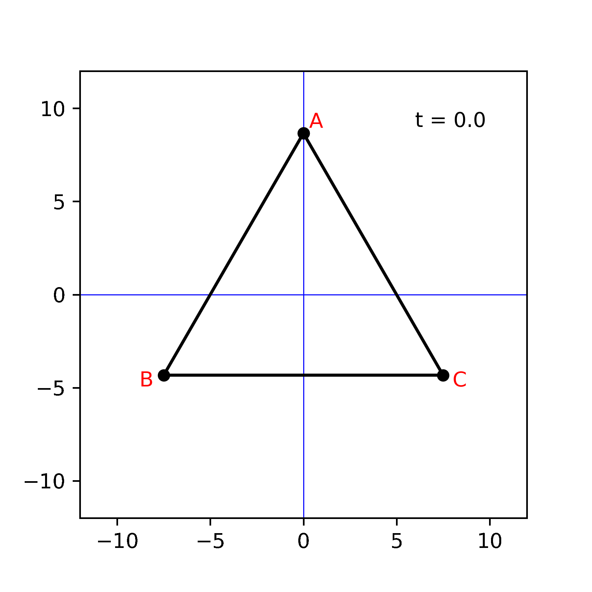

Relative Speed
======================================

In a straight line
-----------------------

A red dot and a blue dot are initially spaced 20 m apart (with the red dot to the left of the blue dot) and are moving to the right with speeds of 10 m/s and 5 m/s, respectively. **After how much time will the red dot pass the blue dot? How much distance would the two dots have covered in that time?**

Here, "m" and "s" stand for meter and second, respectively.

As the blue dot sees it (relative to the blue dot), the red dot is initially 20 m away and is approach towards it at 10 - 5 = 5 m/s. Thus, the 20 m separation will become 0 in 20/5 = 4 s.

In 4 s, the red and the blue dots would have covered 4 x 10 = 40 m and 4 x 5 = 20 m distance, respectively.

======================================

What happens if the speeds of the two dots are interchanged?

A similar calculation tell us that the red dot is approaching at 5 - 10 = - 5 m/s. The negative result is indicating that relative to the blue dot, the red dot is moving away at 5 m/s. Thus, the points will never meet. Moreover, the spacing between the two is increasing at a rate of 5 m every 1 s.

======================================

Now the problem is changed. The dots are initially 60 m apart and are moving towards each other. The blue dot is moving to the left at 10 m/s and the red dot is moving to the right at 5 m/s.

The solution can be cast either relative to the blue dot or relative to the red dot. For a change, let us cast it relative to the red dot. The set dot sees the blue dot is initially 60 m away and is approaching at 10 + 5 = 15 m/s. Thus, the 60 m separation will be closed in 60/15 = 4 s. The blue and the red dots would have covered 4 x 10 = 40 m and 4 x 5 = 20 m, respectively, in that time.

======================================

Example problem:

A motor boat whose speed in still water is 10 miles/hour went 91 miles downstream and returned. What is the speed of the riverflow if the trip took 20 hours?

.. math::

   & v:~\text{Speed of the riverflow}

   & \text{Upstream speed of the boat relative to the bank} = 10 - v

   & \text{Downstream speed of the boat relative to the bank} = 10 + v

   & \text{Time taken} = \text{Distance} / \text{Speed}

   & 20 = \frac{91}{10+v} + \frac{91}{10-v}

   & 20 = \frac{91(10-v)+91(10+v)}{100-v^2}=\frac{91\times 20}{100-v^2}

   & 100-v^2=91 \implies v=3~\text{miles/hour}

In a circle
-----------------------

A similar analysis can be done for points moving on a circle. Consider a circle of circumference 200 m. The red and the blue dots move at 20 m/s and 10 m/s, respectively. The red dot starts at the top of the circle and the blue dot at the rightmost point. In the first case, the points move in the same sense (clockwise). In the second case, they move in opposite sense. **After what time will the points meet for the first time? Where on the circle will they meet? After what time past the first meeting will the second meeting take place? Where on the circle will the second meeting happen?**

**First case**:

The blue point sees the red particle approaching clockwise at 20-10 = 10 m/s. The initial spacing for clockwise motion is 200/4 = 50 m. Thus, the points meet for the first time after 50/10 = 5 s. The blue point would have covered 5 x 10 = 50 m (a quarter circle) in that time. Thus, they meet  for the first time at the bottom of the circle.

Between the first and the second meeting, the red point needs to cover one entire circle relative to the blue point. This happens in 200/10 = 20 s (circle distance divided by the relative speed). The blue and the red points would have covered 20 x 10 = 200 m and 20 x 20 = 400 m, respectively, in this time. Thus, the second meeting also happens at the bottom of the circle. Between the two meeting, the blue point goes around the circle once and the red point twice.

**Second case**:

The blue point sees the red particle approaching anticlockwise at 20+10 = 30 m/s. The initial spacing for anticlockwise motion is 200 x 3/4 = 150 m. Thus, the points meet for the first time after 150/30 = 5 s. The blue point would have covered 5 x 10 = 50 m (a quarter circle) in that time. Thus, they meet for the first time at the bottom of the circle. This is same as in the first case.

Between the first and the second meeting, the red point needs to cover one entire circle relative to the blue point. This happens in 200/30 = 6.667 s (circle distance divided by the relative speed). The blue and the red points would have covered 10 x 6.667 = 66.67 m and 20 x 6.67 = 133.34 m, respectively, in this time. Thus, the between the meeting, the blue dot covers a little more than a quarter circle. The first meeting happens at the bottom of the circle. Hence, the second meeting happens between the leftmost point and the top of the circle.

======================================

Example problems:

Annie and Bonnie are running laps around a 400-meter oval track. They started together, but Annie has pulled ahead because she runs 25% faster than Bonnie. How many laps will Annie have run when she first passes Bonnie?

.. math::

   & v_B = x,~v_A=1.25 x~\text{(Their speeds)}

   & \text{Time of first pass} = \frac{400}{v_B-v_A}

   & \text{Number of laps Annie runs in that time} =\frac{ v_A\times \text{Time of first pass}}{400} = \frac{v_A}{v_B-v_A} = \frac{1.25}{1.25-1.00}=5

======================================
   
Alice and Bob play a game involving a circle whose circumference is divided by 12 equally-spaced points. The points are numbered clockwise, from 1 to 12. Both start on point 12. Alice moves clockwise and Bob, counterclockwise. In a turn of the game, Alice moves 5 points clockwise and Bob moves 9 points counterclockwise. The game ends when they stop on the same point. How many turns will this take?

Relative to Bob, Alice moves 5 + 9 = 14 points towards him every turn. To meet at the same point, Alice should cover an integer multiple of 12 points relative to Bob. With 14 points in each turn, the smallest number of turns that results in an integer multiple of 12 is 6 turns.

	  
Chasing particles
--------------------

Consider the following problem. Three points A, B, and C are initially at the vertices of an equilateral triangle of side 15 m. They start moving such that point A chases point B, point B chases point C, and point C chases point A, all the same speed of 1 m/s. Note that at any point in time the speed of a point is directed towards the point that it is chasing. **After how much time will the particles meet?**

The three points are symmetrical. Thus, they will maintain an equilateral triangle configuration at all times. However, the equilateral triangle will rotate and shrink. By symmetry, the point of meeting will be the unique circumcenter of all the equilateral triangles.

Most of the analysis follows 30-60-90 triangle math. The circumradius of the initial equilateral triangle is :math:`\frac{15}{\sqrt{3}}` m. 

At any time, the speed of a point is 1 m/s along the side of the equilateral triangle created by the points at that time. Thus, the distance of the point to the center is decreasing at the rate of :math:`\frac{\sqrt{3}}{2}` m/s. 

Therefore, the distance will become 0 after :math:`\left(\frac{15}{\sqrt{3}}\right)/\left(\frac{\sqrt{3}}{2}\right)=\left(\frac{15}{\sqrt{3}}\right)\cdot\left(\frac{2}{\sqrt{3}}\right)=10` s.

Similar problems can be framed for any regular polygon. **The key is to finding the circumradius and the speed towards the center of the circumcircle**.
