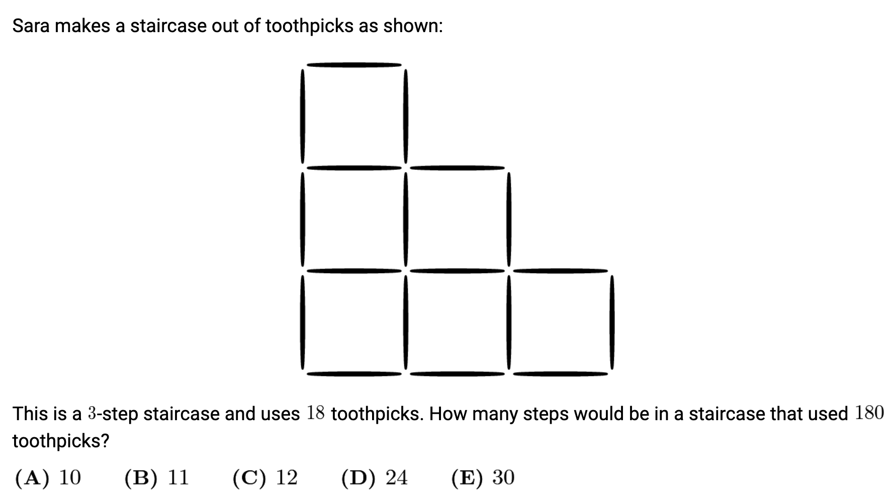

Summation and Products (Finite Terms)
===========================================

Sequence
----------

Consider the formula :math:`a_n=2n+1`. By changing the value of :math:`n` from 1 to 5 in the formula, we can generate a **sequence** of terms :math:`a_1,~a_2,~a_3,~a_4,~a_5` or :math:`3,~5,~7,~9,~11`.

Notation
-------------------

Sum Notation
^^^^^^^^^^^^^^

Consider the sum

.. math::

   1+2+3+\ldots+98.

Here we are adding a variable :math:`k` where the value of :math:`k` goes from 1 to 98. This can be written compactly as

.. math::

   \sum_{k=1}^{98} k

Notice that :math:`k` is just a dummy variable in that :math:`k` can be replaced with any other variable (for example :math:`m`) without changing the sum. Thus,

.. math::

   \sum_{m=1}^{98} m

is also a valid way to write the same sum.

How to write the sum

.. math::

   \underbrace{1+1+\ldots+1}_{\text{$100$ terms}}\text{?}

Well, we are just varying the dummy variable from 1 to 100 such that for every value of the dummy variable, the contribution to the sum is :math:`1`. Hence, the sum is

.. math::

   \sum_{k=1}^{100} 1 = 100.

In a sum involving a finite number of terms, the terms can be rearranged or grouped without changing the sum. This follows from commutative and associative properties of addition, and subtraction being essentially addition (see our discussion of real fields). For example,

.. math::

   1+3+5+7+9-2-4-6-8-10 = (1-2)+(3-4)+(5-6)+(7-8)+(9-10) = -1-1-1-1-1=-5.

Any common factor from all the terms can be factored out.

.. math::

    2+4+6+8+10 = 2(1+2+3+4+5)

Therefore, simplifications as the one shown below are valid.

.. math::

   \sum_{k=1}^{20} \left(2k^2-k+7\right)=2\sum_{k=1}^{20} k^2-\sum_{k=1}^{20} k +7\sum_{k=1}^{20} 1

Note that the variable range need not begin at 1. For example, the sum :math:`5+7+9+11+13` can be written in different ways.

.. math::

   \sum_{k=1}^{5} (3+2k)=\sum_{k=3}^{7} (2k-1)

Product Notation
^^^^^^^^^^^^^^^^^^

Analogous to the sum notation, the product

.. math::

   1\times 2\times 3\times 4\times \ldots\times 98

is written as

.. math::

   \prod_{k=1}^{98} k.

As in the case of sums, the products can be rearranged and grouped (commutative and associative products of multiplication). One word of caution: the rearrangement and grouping here is in terms of mutliplicative factors, not additive terms in the case of sums. For example,

.. math::

   & \prod_{k=1}^{98} (k^2+k)\neq \prod_{k=1}^{98} k^2 + \prod_{k=1}^{98} k~\textbf{(Notice the not equal to)}

   & \prod_{k=1}^{98} (k^2+k)=\prod_{k=1}^{98} k(k+1)=\prod_{k=1}^{98} k \times \prod_{k=1}^{98} (k+1)

Additionally, handling of constant terms is different from the summation.

.. math::

   \underbrace{3\times 3\times \ldots \times 3}_{\text{$100$ terms}}=\prod_{k=1}^{100} 3=3^{100}

Telescoping Sums and Products
-------------------------------

Referring to our discussion of a sequence above, sums and products can be written down in terms of sequence terms.

For example, :math:`\sum_{k=1}^{5} \left(2k^2-k+7\right)` can be written as

.. math::

   \sum_{k=1}^{5} a_k~\text{where}~a_k=2k^2-k+7

and :math:`\prod_{p=1}^{5} p^2` can be written as

.. math::

   \prod_{p=1}^{5} b_p~\text{where}~b_p=p^2

=================================================
   
Consider the following sum :math:`S=\frac{1}{1\cdot 2}+\frac{1}{2\cdot 3}+\frac{1}{3\cdot 4}+\frac{1}{4\cdot 5}+\ldots+\frac{1}{99\cdot 100}`. We do some simplifications and write this sum using our sequence notation.

.. math::

   S &=\sum_{n=1}^{99} \frac{1}{n(n+1)}=\sum_{n=1}^{99}\left[\frac{1}{n}-\frac{1}{n+1}\right]~\text{(Simplification using partial fractions)}
   
   &=\sum_{n=1}^{99}\left(c_n - c_{n+1}\right)~\text{where}~c_n=\frac{1}{n}

   &=c_1-c_2+c_2-c_3+c_3-c_4+\ldots+c_{99}-c_{100}

   &=c_1+(c_2-c_2)+(c_3-c_3)+(c_4-c_4)+\ldots+(c_{99}-c_{99})-c_{100}

   &=c_1-c_{100}=1-\frac{1}{100}=\frac{99}{100}

Such sums where only the initial few and the final few terms contribute and all the terms in the middle mutually cancel out are called telescoping sums.

Note, more on partial fractions can be found :ref:`here <partialFractions:Partial Fractions>`.

=================================================

Another example is the sum :math:`S=\frac{1}{1+\sqrt{2}}+\frac{1}{\sqrt{2}+\sqrt{3}}+\ldots+\frac{1}{\sqrt{99}+\sqrt{100}}`.

.. math::

   S &=\sum_{k=1}^{99} \frac{1}{\sqrt{k}+\sqrt{k+1}}

   &=\sum_{k=1}^{99} \frac{1}{\sqrt{k}+\sqrt{k+1}}\cdot \frac{\sqrt{k+1}-\sqrt{k}}{\sqrt{k+1}-\sqrt{k}}~\text{(Using our radical simplication method)}

   &=\sum_{k=1}^{99} \frac{\sqrt{k+1}-\sqrt{k}}{(k+1)-k}~\text{(Using $(a+b)(a-b)=a^2-b^2$ in the denominator)}

   &=\sum_{k=1}^{99} \frac{\sqrt{k+1}-\sqrt{k}}{1} =\sum_{k=1}^{99} -\sqrt{k}+\sqrt{k+1}

   &=\sum_{k=1}^{99} d_{k}-d_{k+1}~\text{where}~d_k=-\sqrt{k}

   &=d_1-d_2+d_2-d_3+\ldots+d_{99}-d_{100} = d_1-d_{100}=\sqrt{100}-1=9

We used the radical simplication method described :ref:`here <radicalSimplification:Removing radicals from the denominator>`.

=================================================

This concept of mutual cancellation of terms in the middle works for products as well. Here, the cancellation is multiplicative i.e. terms in the numerator and in the denominator cancel out.

Here is an example:

:math:`P=\left(1+\frac{1}{1}\right)\left(1+\frac{1}{2}\right)\ldots\left(1+\frac{1}{100}\right)`.

.. math::

   P &= \prod_{k=1}^{100} \left(1+\frac{1}{k}\right) = \prod_{k=1}^{100} \frac{k+1}{k}

   &= \prod_{k=1}^{100} \frac{a_{k+1}}{a_k}~\text{where}~a_k=k

   &= \frac{a_2}{a_1}\cdot\frac{a_3}{a_2}\cdot\frac{a_4}{a_3}\cdot\ldots\cdot\frac{a_{101}}{a_{100}}

   &=\frac{a_{101}}{a_1}= 101

=================================================

Other examples:

.. math::

   P &= \left(1-\frac{1}{2^2}\right)\left(1-\frac{1}{3^2}\right)\left(1-\frac{1}{4^2}\right)\ldots\left(1-\frac{1}{200^2}\right)

   &= \prod_{k=2}^{200} \left(1-\frac{1}{k^2}\right)= \prod_{k=2}^{200} \frac{k^2-1}{k^2}

   &= \prod_{k=2}^{200} \frac{(k-1)(k+1)}{k^2}=\prod_{k=2}^{200} \frac{k-1}{k}\cdot\frac{k+1}{k}

   &= \prod_{k=2}^{200} \frac{a_k}{a_{k+1}}~\text{where}~ a_k=\frac{k-1}{k}

   &= \frac{a_2}{a_3}\cdot\frac{a_3}{a_4}\cdot\ldots\cdot\frac{a_{200}}{a_{201}} = \frac{a_2}{a_{201}}

   &= \frac{1}{2}\cdot\frac{201}{200} = \frac{201}{400}

=================================================

.. math::

   S &= \frac{1}{1\cdot 3}+\frac{1}{3\cdot 5}+\frac{1}{5\cdot 7}+\ldots+\frac{1}{255\cdot 257}

   &= \sum_{k=1}^{128} \frac{1}{(2k-1)(2k+1)} = \sum_{k=1}^{128} \left[\frac{1}{2(2k-1)}-\frac{1}{2(2k+1)}\right]

   &\text{(Partial fractions used in the above step)}

   &= \frac{1}{2}\sum_{k=1}^{128} \left(\frac{1}{2k-1}-\frac{1}{2k+1}\right)

   &= \frac{1}{2}\sum_{k=1}^{128} \left(a_{k}-a_{k+1}\right)~\text{where}~ a_k=\frac{1}{2k-1}

   &= \frac{a_1-a_{129}}{2}=\frac{1}{2}\left(1-\frac{1}{22\times 129-1}\right)=\frac{1}{2}\left(1-\frac{1}{257}\right)=\frac{128}{257}

=================================================

.. math::

   S &= 1\cdot 2-2\cdot 3+3\cdot 4-4\cdot 5+\ldots+2001\cdot 2002

   &= (1\cdot 2-2\cdot 3)+(3\cdot 4-4\cdot 5)+\ldots+(1999\cdot 2000-2000\cdot 2001)+2001\cdot 2002

   &= 2001\cdot 2002 + \sum_{k=1}^{1999} \left[k(k+1)-(k+1)(k+2)\right]

   &= 2001\cdot 2002 + \sum_{k=1}^{1999} \left(a_k-a_{k+1}\right)~[a_k=k(k+1)]

   &= 2001\cdot 2002 + a_1-a_{2000}=2001\cdot 2002 + 1\cdot 2 - 2000\cdot 2001

   &= 2001\cdot(2002-2000)+2 = 2001\cdot 2+2 = 4004

=================================================

.. math::

   P &= \frac{1}{3}\cdot\frac{2}{4}\cdot\frac{3}{5}\cdot\ldots\cdot\frac{18}{20}\cdot\frac{19}{21}\cdot\frac{20}{22}

   &=\prod_{k=1}^{20} \frac{k}{k+2}=\prod_{k=1}^{20} \frac{k}{k+1}\cdot \frac{k+1}{k+2}

   &=\left(\prod_{k=1}^{20} \frac{k}{k+1}\right)\cdot\left(\prod_{k=1}^{20} \frac{k+1}{k+2}\right)

   &=\left(\prod_{k=1}^{20} \frac{a_k}{a_{k+1}}\right)\cdot\left(\prod_{k=1}^{20} \frac{b_k}{b_{k+1}}\right)

   &(a_k=k,~b_k=k+1)

   &=\frac{a_1}{a_{21}}\cdot \frac{b_1}{b_{21}}=\frac{1}{21}\cdot\frac{2}{22}=\frac{1}{231}

=================================================

.. math::

   S &= 100-98+96-94+92-90+\ldots+8-6+4-2

   &= (100-98)+(96-94)+(92-90)+\ldots+(8-6)+(4-2)

   &= \sum_{k=1}^{25} \left[4k-(4k-2)\right]=\sum_{k=1}^{25} 2=2\sum_{k=1}^{25} 1=2\times 25 = 50

=================================================

.. math::

   P &= \left(\frac{1\cdot 3}{2\cdot 2}\right)\left(\frac{2\cdot 4}{3\cdot 3}\right)\left(\frac{3\cdot 5}{4\cdot 4}\right)\ldots\left(\frac{97\cdot 99}{98\cdot 98}\right)\left(\frac{98\cdot 100}{99\cdot 99}\right)

   &= \prod_{k=1}^{98} \frac{k(k+2)}{(k+1)(k+1)} =\left[\prod_{k=1}^{98} \frac{k}{k+1}\right]\left[\prod_{k=1}^{98} \frac{k+2}{k+1}\right]

      &= \left[\prod_{k=1}^{98} \frac{a_k}{a_{k+1}}\right]\left[\prod_{k=1}^{98} \frac{b_{k+1}}{b_k}\right]

      &\left[a_k=k,~b_k=k+1\right]

      &= \frac{a_1}{a_{99}}\cdot\frac{b_{99}}{b_1}=\frac{1}{99}\cdot\frac{100}{2}=\frac{50}{99}

=================================================

Consider the following problem from the practice problems:

Let :math:`a_k` be the number of toothpicks in a k-step staircase.

:math:`a_1=4`

In such problems, it is a good idea to develop some intuition by working out a first few steps.
      
When we go from a one-step to a two-step staircase, we add 3 toothpicks each to create two corner squares. When we go from a two-step staircase, we add 3 toothpicks each to create two corner squares and 2 toothpicks for a non-corner square. One can imagine what happens for the fourth-step. We again add 3 toothpicks each for two new corner squares and 2 toothpicks each for two non-corner squares.

Thus, with every additional step, the number of new corner squares (that need 3 new toothpicks) is the same, and the number of new-non-corner squares (that need 2 new toothpicks) increases by one. Going from an (k-1)-step staircase to k-step staircase, we add 2 new corner squares and (k-2) new non-corner squares.

Thus for k>1,

.. math::

   & a_{2} = a_{1} + 3\times 2 + 2\times 0

   & a_{3} = a_{2} + 3\times 2 + 2\times 1

   & a_{4} = a_{3} + 3\times 2 + 2\times 2

   & \vdots

   & a_{k} = a_{k-1} + 3\times 2 + 2\times (k-2)

Adding all the equations, there is a telescopic effect whereby (among the a's), only :math:`a_k` remains on the left hand side and onlu :math:`a_1` remains on the right hand side.

.. math::

   a_k & = a_1 + 6(k-1) + 2\left[1+2+\ldots+(k-2)\right]

   & = 4 + 6(k-1) + (k-1)(k-2) = k^2 + 3k

Set :math:`a_k` to 180 and solve for :math:`k`.

.. math::

   & k^2+3k-180 = 0

   & (k-12)(k+15)=0

   & k=12,~k=-15

   &\text{The positive root is 12}

   
 

   

   

   
