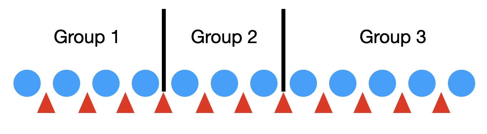

Stones and Sticks Principle
======================================

In our discussion of the :ref:`inclusion-exclusion principle <inclusionExclusion:Distinguishable Distributions>` , we had come across the following problem:

In how many ways can 12 distinguishable presents be given to three people such that every person gets at least one present and all the presents are given out?

Now we modify the problem such that the 12 presents are indistinguishable. The difference from the earlier problem is that now only the present count matters. In the earlier problem, exactly which present was given mattered.

This problem can be solved using the stones and sticks principle. Imagine that the 12 presents are 12 stones placed in a row (blue circles in the image below). We will make three groups of stones by placing two sticks (the black vertical lines) in two of the 11 gaps (gaps are shown by the red pointers) between the stones. This will ensure that the stones are divided into three groups and none of the three groups is empty. The first group of stones (presents) go to the first person, the second group to the second person, and the third group to the third person.

Thus, the problem reduces to choosing 2 of the 11 gaps for the sticks. So the answer is C(11,2). By ensuring that only one stick goes in a gap, we guarantee that no group is empty.

=================================================

This problem is equivalent to the following problem:

Find the number of integer solutions to

:math:`x_1+x_2+x_3=12` such that :math:`x_1\geq 1,~x_2\geq 1,~x_3\geq 1`.

=================================================

If we modify the problem such that not giving any present to a person is allowed, yet all 12 presents have to be given out, then the equivalent problem is

Find the number of integer solutions to

:math:`x_1+x_2+x_3=12` such that :math:`x_1\geq 0,~x_2\geq 0,~x_3\geq 0`.

The inequality constraints have changed. Now 0 is allowed as a value for the variables.

This problem can be changed to the earlier form (where stones and sticks principle was applicable) by making a change of variables.

Let :math:`y_1=x_1+1,~y_2=x_2+1,~y_3=x_3+1`.

:math:`y_1+y_2+y_3=12+1+1+1=15` such that :math:`y_1\geq 1,~y_2\geq 1,~y_3\geq 1`.

15 stones (14 gaps) and  3 groups (2 sticks) leads to the answer C(14,2).

=================================================

In fact, this approach can be used for arbitrary combinations of lower bound constraints. For example,

:math:`x_1+x_2+x_3=12` such that :math:`x_1\geq 2,~x_2\geq 3,~x_3\geq 4`.

Let :math:`y_1=x_1-1,~y_2=x_2-2,~y_3=x_3-3`.

:math:`y_1+y_2+y_3=12-1-2-3=6` such that :math:`y_1\geq 1,~y_2\geq 1,~y_3\geq 1`.

6 stones (5 gaps) and  3 groups (2 sticks) leads to the answer C(5,2).

=================================================

How to handle mixed lower bound and upper bound constraints?

12 presents need to be given out in such a way that the first person needs to get any number of presents from 3 to 6 (both inclusive), the second person needs to get any number of presents from 2 to 4 (both inclusive), and the third person needs to get at least one present.

The equivalent problem is

:math:`x_1+x_2+x_3=12` such that :math:`6\geq x_1\geq 3,~4\geq x_2\geq 2,~x_3\geq 1`.

Inclusion-exclusion principle needs to be applied.

Set U:

Integer solutions to

:math:`x_1+x_2+x_3=12` such that :math:`x_1\geq 3,~x_2\geq 2,~x_3\geq 1`.

Set A:

Integer solutions to 

:math:`x_1+x_2+x_3=12` such that :math:`x_1\geq 7,~x_2\geq 2,~x_3\geq 1`.

Set B:

Integer solutions to

:math:`x_1+x_2+x_3=12` such that :math:`x_1\geq 3,~x_2\geq 5,~x_3\geq 1`.

The answer to our problem is

:math:`\#U-\#(A\cup B)`.

=================================================   

.. toctree::

   recurrence.rst
