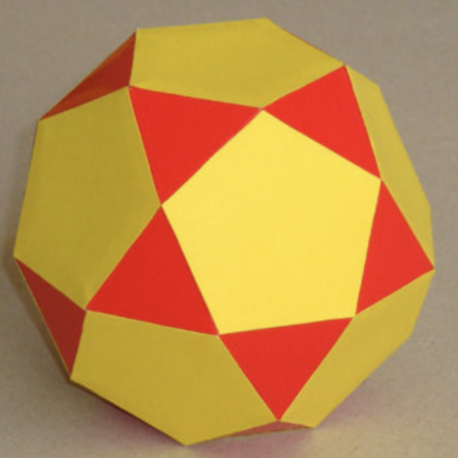
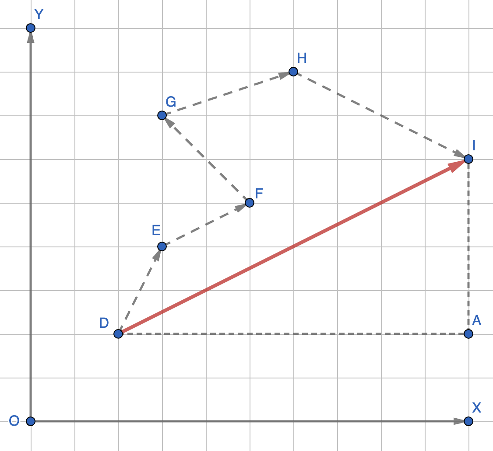
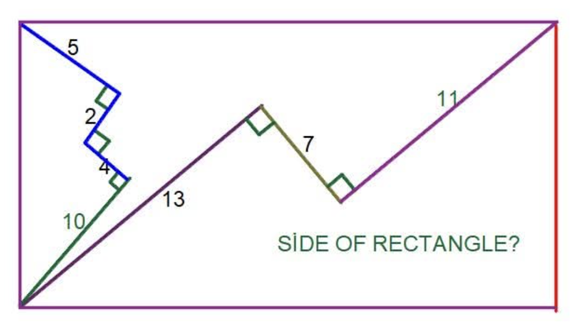
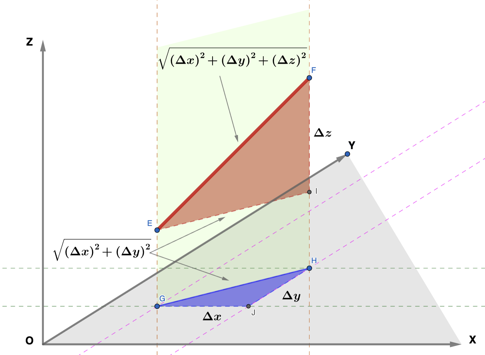
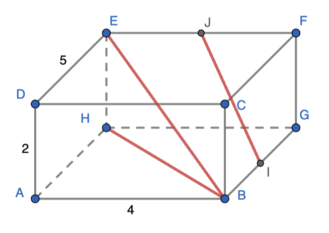
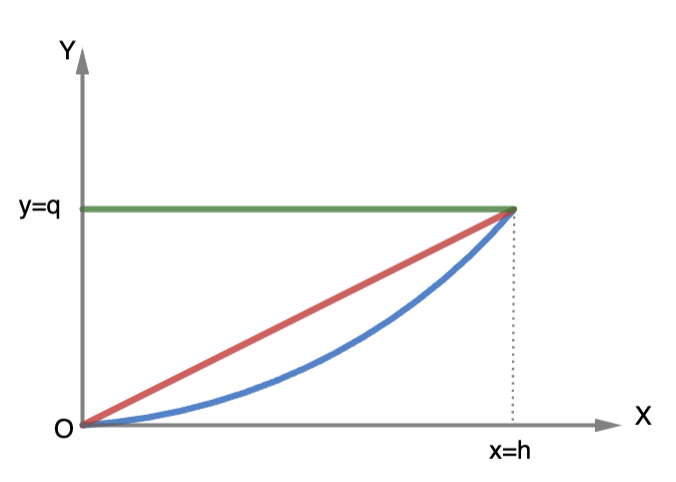
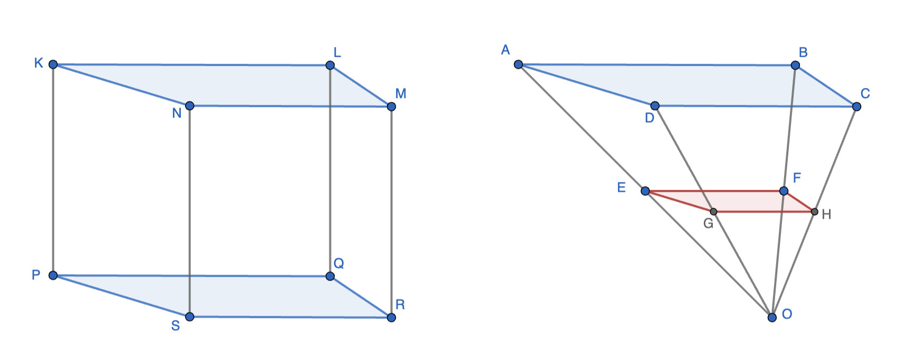
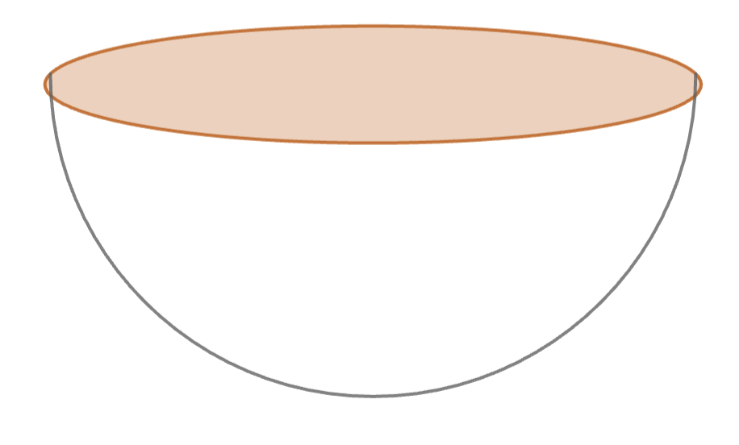

Three-Dimensional Geometry
======================================

Polyhedra
------------------

3D equivalent of polygons - polygonal faces and straight edges

We restrict ourselves to convex polyhedra. If any two points on the polyhedra are connected by a line segment, the line segment should not have any part outside the polyhedra.

For a convex polyhedra, the following relationship attributed to Euler holds:

.. math::

   &\textbf{F + V = E +2}

where **F: Number of faces, V: Number of vertices, and E: Number of edges**.

======================================

Here is an example problem:

The polyhedron in the above figure has 20 triangular faces and 12 pentagonal faces. How many edges and vertices does it have?

In this problem, it is easier to find out how many polygons meet at an edge (the answer is 2) than to find out how many polygons meet at a vertex.

First step: Count the edges contributed by all the faces

.. math::

   20 \times 3 + 12 \times 5 = 120

However, each edge is formed by two faces meeting. Hence, we have counted each edge twice in the above calculation. So divide by 2 to get the number of edges.

.. math::

   E = \frac{120}{2}=60

Euler's formula then gives us the number of vertices.

.. math::

   F + V &= E + 2

   32 + V &= 60 + 2 \implies V = 30
	  

Distance in 2D
------------------

Let us first start with 2D.

In the figure above, applying Pythagoras theorem, the distance DI can be calculated as :math:`DI=\sqrt{DA^2+AI^2}`. If an XY coordinate system is attached to the figure such that DA is along X and AI is along Y, then DA is the change in the X coordinate - :math:`\Delta x` - and AI is the change in the Y coordinate - :math:`\Delta y` - as one goes from D to I. Thus,

.. math::

   DI=\sqrt{(\Delta x)^2+(\Delta y)^2}.

Alternatively, :math:`\Delta x` and :math:`\Delta y` can be calculated by summing the change in X and Y coordinates along DE, EF, FG, GH, and HI.

.. math::

   \Delta x&= \Delta x_{DE} + \Delta x_{EF} + \Delta x_{FG} + \Delta x_{GH} + \Delta x_{HI}

   \Delta y&= \Delta y_{DE} + \Delta y_{EF} + \Delta y_{FG} + \Delta y_{GH} + \Delta y_{HI}

The choice of the origin and the direction of the X axis was arbitrary. Thus, the above relations hold for any choice of X and Y coordinates.	  

======================================

Now, consider the following problem:

The segment chain with lengths 13, 7, and 11 starts at one end of the diagonal and ends at the other end. Hence, we could use this segment to compute the diagonal. An obvious choice of the coordinate system is to choose X axis parallel to the 13 and 11 segements (bottom-left to top-right) and Y axis parallel to the 7 segment (down-right to up-left). With this choice,

.. math::

   \Delta x &= 13 + 11 = 24

   \Delta y &= -7

   \text{Diagonal}~&=~\sqrt{(\Delta x)^2+(\Delta y)^2}=\sqrt{24^2+7^2}=25

Note that the location of the origin did not matter.

The segment chain with lengths 10, 4, 2, and 5 starts at the bottom-left corner of the rectangle and ends at the top-left corner. Thus, this should allow us to compute the width of the rectangle. For this computation, we can choose a different set of axes, X-axis parallel to the 10 segment (bottom-left to top-right) and Y-axis parallel to the 4 segment (bottom-right to top-left).

.. math::

   \Delta x &= 10 + 2 = 12

   \Delta y &= 4+5=9

   \text{Width}~&=~\sqrt{(\Delta x)^2+(\Delta y)^2}=\sqrt{12^2+9^2}=15

Note that in the calculation of both diagonal and width, a Pythogorean triplet or its multiple was involved. This may not always be true.

The length of the rectangle can be computed from the diagonal and the width.

Distance in 3D
------------------

When dealing with distances in 3D, we need a third Z axis that is perpendicular to both X and Y. The distance is then be given by

.. math::

   \sqrt{(\Delta x)^2 + (\Delta y)^2 + (\Delta z)^2}

In the above figure, the objective is to find length EF. X, Y, Z is an arbitrary coordinate system such that the X, Y, and Z axes are perpendicular to each other. 

As one traverses from E to F, the X, Y, and Z coordinates chnage by :math:`\Delta x`, :math:`\Delta y`, :math:`\Delta z`, respectively. GH is the projection (shadow) of EF on the XY plane. Thus, as one traverses from G to H, X and Y change by the same amount as in the case of traversal from E to F. However, there is no change in the Z coordinate. Using Pythagoras, as in the 2D case, :math:`GH=\sqrt{(\Delta x)^2 + (\Delta y)^2}`. Note that EI is just a parallel translation of GH in the Z direction without change in length. Thus, :math:`EI=\sqrt{(\Delta x)^2 + (\Delta y)^2}`. FI is perpendicular to EI nd has length :math:`\Delta z`. Applying Pythagoras to triangle EIF,

.. math::

   EF^2 & = EI^2 + IF^2

   & = (\Delta x)^2 + (\Delta y)^2 + (\Delta z)^2

   EF = \sqrt{(\Delta x)^2 + (\Delta y)^2 + (\Delta z)^2}

======================================

Example: In the rectangular prism below, I and J are the mid-points of BG and EF, respectively. AB=4, AD=2, and DE=5. Find BH (face diagonal), BE (body diagonal), and IJ.

AB, AD, and AH are perpendicular to each other. Let us choose X along AB, Y along AH, and Z along AD.

As one traverses from B to H:

.. math::

   \Delta x &= -4,~\Delta y = 5,~\Delta z = 0

   BH &= \sqrt{(-4)^2+(5)^2}=\sqrt{41}

As one traverses from B to E:

.. math::

   \Delta x &= -4,~\Delta y = 5,~\Delta z =2

   BE &= \sqrt{(-4)^2+(5)^2+(2)^2}=\sqrt{45}

As one traverses from I to H:

.. math::

   \Delta x &= -\frac{4}{2}=-2,~\Delta y = \frac{5}{2},~\Delta z =2

   IJ &= \sqrt{(-2)^2+\left(\frac{5}{2}\right)^2+(2)^2}=\sqrt{\frac{57}{4}}=\frac{\sqrt{57}}{2}
   

Surface Area and Volume
----------------------------

Let us begin with an observation. In the figure below are shown three functions of :math:`x`. The green function takes a constant value of :math:`q` over :math:`0<x<h`. The red function grows linearly from :math:`0` to :math:`q`, and the blue function grows quadratically from :math:`0` to :math:`q`. The area under the green curve (and above the X axis) over :math:`0<x<h` is :math:`qh`. The area under the red curve is half of that i.e. :math:`\frac{qh}{2}`, and the area under the blue curve is :math:`\frac{qh}{3}` (stated without proof).

.. math::

   &\text{Area under green curve} = qh

   &\text{Area under red curve} = \frac{qh}{2}

   &\text{Area under blue curve} = \frac{qh}{3}
   	 
======================================

The figure below shows a prism (left) and a pyramid (right). The left solid is generated by sweeping a fixed template - the base of the prism - from the bottom to the top. The surface area of the side of the prism can be thought of being generated by the perimeter of the base being swept through the height of the prism. Similarly the volume of the prism is generated by the sweeing of the base area through the height. The side surface area is the area under the green curve above with :math:`q` replaced by the perimeter and :math:`h` the height of the prism. The volume is the area under the green curve awith :math:`q` replaced by the base area. To get the total surface area, the areas of the bottom and top faces need to be added to the side surface area.

	  

.. math::

   &\text{Surface area of prism} = \text{Perimeter of base}~\times~\text{Height} + 2\times~\text{Base area}

   &\text{Volume of prism} = \text{Base area}~\times~\text{Height}

For the pyramid, any linear dimension of the base increases linearly as the base template is swept from bottom to the top. As the pyramid is swept from the bottom to the top, the bases generated are all similar. Thus, the perimeter of the base increases linearly. On the other hand, the area of the base increases quadratically. Thus, the side surface area computation is equivalent to finding the area under the red curve with :math:`q` the perimeter. The volume computation is equivalent to finding the area under the blue curve with :math:`q` the base area at the top. For the total surface area, just the surface area of the base at the top needs to be added. Therefore,

.. math::

   &\text{Surface area of pyramid} = \frac{1}{2}\times\text{Perimeter of base}~\times~\text{Height} + \text{Base area at the top}

   &\text{Volume of pyramid} = \frac{1}{3}\times\text{Base area at the top}~\times~\text{Height}

The red and the blue bases are similar and their linear dimension scale-factors is just the ratio of the heights at which the bases are located. Thus,

.. math::

   \frac{EF}{AB} &= \frac{FH}{BC} = \frac{CD}{HG} = \frac{DA}{GE}
   
   &=\frac{\text{Perimeter of blue base}}{\text{Perimeter of red base}}

   &=\frac{\sqrt{\text{Area of blue base}}}{\sqrt{\text{Area of red base}}}

   &=\frac{\sqrt[3]{\text{Volume under blue base}}}{\sqrt[3]{\text{Volume under red base}}}

   &=\frac{\text{Height of blue base}}{\text{Height of red base}}
   
A cone is a special case of a pyramid with circular base. Hence the volume of a cone is :math:`\frac{1}{3}\times \pi r^2 \times h` where :math:`r` is the radius of the base and :math:`h` is the height of the cone.

======================================

The hemisphere can be thought of as a pyramid with height equal to the radius - R. Hoever, the circumference and area of the circular template grows neither linearly, not quadratically. 

In this case,

.. math::

   &\text{Area of the side (excluding the cap)} = (2\pi R) \times (R)=2\pi R^2

   &\text{Volume of hemisphere} = \frac{2\pi}{3}\times \left(\pi R^2\right) \times (R) = \frac{2\pi R^3}{3}

By doubling the results, we get the corresponding parameters for a sphere.

.. math::

   &\text{Surface area of sphere} = 4\pi R^2

   &\text{Volume of sphere} = \frac{4\pi R^3}{3}
